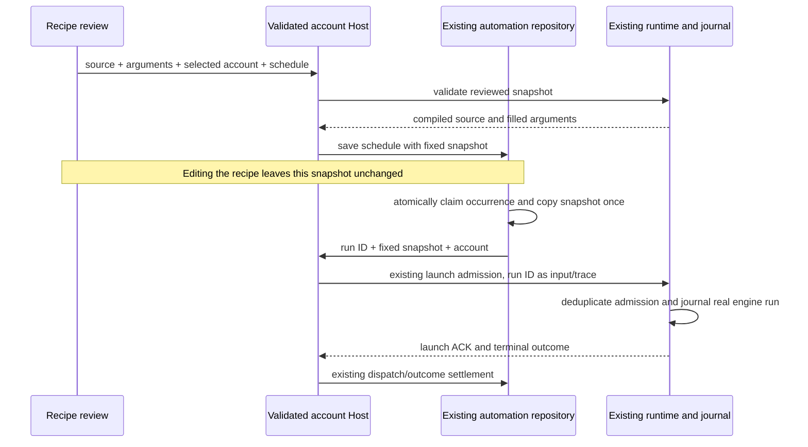

# Account-owned saved script recipes

## Approved product boundary

On 2026-10-03 the user selected recipes belonging to each account. The original migration requires adapting the existing saved-workflow engine, scheduler and history. Saved prompt templates remain useful, but do not constitute this script-engine acceptance. Recipe execution is bound to the account selected at admission, not whichever account Renderer later displays. Use current editorial profile, memory and policy through the existing Host Social Agent context contract. Supervised publication and exact-export approval remain mandatory unless the account explicitly authorizes the existing autonomous policy.

Do not create another scheduler, script engine or authoritative run-history store. The existing CLI saved-workflow store owns definitions and parsing; its dynamic-workflow journal owns engine runs, actor lifecycle and replay. The existing automation repository/scheduler owns schedules, manual/scheduled claims and dispatch history. Host owns account identity validation and routing. Renderer owns drafts and derived lists. Main continues process dispatch and message routing only.

```mermaid
sequenceDiagram
    participant UI as Account Automations / conversation
    participant Host as Account admission and routing
    participant Scheduler as Existing automation owner
    participant Agent as Existing session runtime
    participant Store as Existing saved-workflow store and journal
    participant Actor as Account-scoped workflow actor
    UI->>Host: select/save/run recipe for account
    Host->>Store: resolve only validated account recipe root
    UI->>Scheduler: optional account schedule
    Scheduler->>Host: existing owner/lease admission
    Host->>Agent: trusted account identity and recipe source
    Agent->>UI: existing visible execution approval
    UI->>Agent: approve concrete script
    Agent->>Store: journal run and immutable submitted source
    Agent->>Actor: same account tools and permission boundary
    Actor->>Host: typed media/project/context commands
    Host-->>Actor: owned facts and admitted results
    Actor->>Store: settlement and replay facts
    Store-->>UI: account-filtered history/artifacts
```

## Confirmed source gaps and implementation constraints

`core/src/runtime/helpers/tool-allowlist.ts` exposes only social tools for social-account identities. Do not broaden it to all generic workflow/coding tools. `ListSavedWorkflows` currently searches project and global roots; `SaveWorkflow` accepts global scope and a filesystem script source; `CreateWorkflow` accepts arbitrary file paths and saved global definitions. Account behavior must reject those alternate roots and paths before reading or displaying anything. Validate canonical account workspace identity through the existing Host resolver and use its private account directory. Do not touch legacy user data or migrate unrelated project/global recipes into an account implicitly.

The script runtime inherits parent identity but explicitly creates actors with `mode: "yolo"`; its dependencies currently omit Social Agent/project ports. The engine receives a native execution port separately from actor tool registration. Consequently adding workflow names to the allowlist alone would neither deliver social tools correctly nor establish a safe account boundary. Account scripts must be unable to invoke generic native execution, filesystem reads or unauthenticated network capabilities. Reuse the sandbox/driver's capability injection to constrain these; maintain nested-orchestration restrictions. Actor tool commands must receive the same trusted account ports, stale-revision/owner protections and visible permission routing as account conversation commands. No invisible waits, timeout-based bypass, or permissive fallback.

The current definition store uses synchronous filesystem calls for historical approval preparation. Extend/reuse its parser, serializer, naming rules and single storage path with asynchronous IO; resolve and validate source before the synchronous approval projection rather than creating a second parsing or approval path. New public account views must return names, metadata, script and owned run facts, not administrative credentials, other-account paths or global definitions. Saved source, arguments and any schedule linkage need strict runtime validation and one commit path. Exact public interfaces and capability seams must be finalized against the bounded source contracts before behavior changes.

## Acceptance plan

## Runtime capability interface

The existing run-service and driver dependency bags gain an optional internal `capabilityScope: "social-account"`. `create-app` derives it from the trusted runtime account identity, never script input or Renderer preference. Run launch propagates it to the same driver. For this scope, every world-read operation (`files.*`, `git.*`, `world.run`) fails with the existing structured `WorkflowError("DriverError")` before filesystem or execution ports are touched. `artifact.file` likewise fails before source lookup; in-memory markdown/chart/table artifacts and engine journal/replay retain their existing semantics. No database schema or new environment variable is introduced.

Account actors inherit the parent permission mode after persona configuration is applied. They receive the parent's injected `socialAgentPort` and `socialProjectPort` and its derived child client ports, preserving account validation, trace, root-session permission routing and existing publication/export gates. Generic workflow actors retain their current behavior. Neither persona overrides nor script-requested tool names may widen an account actor's tool surface or replace its identity/working directory. Existing structural restrictions on nested orchestration stay in force. This capability boundary must be tested before exposing saved-workflow tools or a recipe launcher to account users.

### Capability boundary tests

- Exercise every world-read operation using ports whose calls fail the test; account scope must reject without any port call, including a declared/approved `world.run` command.
- Reject `artifact.file` even with a valid artifact store and a source path inside the account directory. Preserve in-memory markdown publication and the artifact owner's parent-session association.
- Inspect actual actor runtime configuration and injected ports: account identity/directory/mode and social ports are inherited, root client permissions retain the existing derived routing, and non-account actors preserve their current mode.

## Definition and scheduling acceptance

On 2026-10-04 the user selected a fixed approved script version for schedules. Updating a saved recipe must not modify any existing schedule's executable snapshot. Replacing the scheduled version is an explicit review-and-save action, including source, validated arguments and account. Every occurrence retains the same account tools, publication gates and journal semantics. A changed recipe cannot silently increase an already approved schedule's capabilities.

### Definition store interface and migration

Extend the existing `SavedWorkflowRootsOptions` with the trusted optional `workspaceIdentity`. Host validates the identity/path pair through its existing account workspace resolver before creating a carrier or runtime. The store rejects malformed account identities. For a canonical account identity, `savedWorkflowRoots` returns only the project root beneath the validated account directory; an explicit global scope and global-to-project move are rejected before IO. Generic workspace roots and first-wins shadowing keep their existing semantics.

Existing definition IO becomes asynchronous on the same public functions (`listSavedWorkflows`, `resolveSavedWorkflow`, `saveSavedWorkflow`, `savedWorkflowExists`, `findSavedWorkflowShadowing`, `moveSavedWorkflow`). Source normalization awaits resolution before projecting the existing synchronous approval payload. The trusted identity is added to `ToolInputResolutionContext`, propagated by the executor, and checked again at the final handler boundary. Account tools accept inline script or an owned saved name, never `path`, `script_path` or global scope. Rejection precedes any source lookup, draft creation, hook or execution. Account lookup failure lists only account recipes.

Use the existing frontmatter codec and metadata/argument validation. Name validation occurs in the store before path construction on every public write, not only in a tool. Account root components and definition files must be regular, private files/directories without symbolic links or hard-linked definition files; definition reads and writes are bounded to 1 MiB of UTF-8 serialized source. Reject excessive input with an explicit error without altering existing definitions. Writes use a same-directory temporary file with mode `0600` and atomic rename; concurrent metadata and full-source writes in a process serialize at the same store owner. The protocol's metadata update and deletion use this owner rather than writing/unlinking resolved paths separately. Existing valid `.dwf.ts` files stay in place; do not import global or another account's definitions. No database change is needed for this definition-store slice.

Tests must cover two isolated accounts with the same recipe name, global exclusion without reading it, malformed identities, traversal names, symlinked directories/files, oversized source, concurrent complete writes and metadata updates, persistence through a new store read, and pre-approval rejection of path/global sources. Native execution remains denied by the previously defined runtime capability boundary.

Account runs retain the immutable source in the existing journal and do not create filesystem draft copies. Inline editing and saved definition updates use the account recipe interface; actors cannot read/edit arbitrary draft paths. Generic workflow draft behavior stays available to generic runtimes.

### Desktop recipe editor and approved execution interface

The account Automations surface gains a separate saved-script recipe section. Its hook resolves the selected account through `ISocialAccountService.resolveConversationWorkspace` and calls the existing injected Agent service. Name, description, argument declarations and inline source are editable drafts; lists and run history are projections from the definition store/journal. Do not show arbitrary filesystem targets, global scope, another account selector, or generic workflow settings. Compilation and argument diagnostics appear before a run or schedule can be accepted. Saving a definition does not authorize its execution.

Add the bounded `workflows/save` workspace RPC to the existing saved-workflow protocol, Host service and remote service contract. It accepts name, project/global scope, metadata and inline script; account scope retains the project-only rule. The core parser/compiler/store remain the owners of validation and commit. Reuse `getSavedWorkflow` for exact source review and `listSavedWorkflowRuns` for history. A direct UI save is the user's concrete write command, while model-initiated `SaveWorkflow` retains its always-ask permission gate.

Extend the existing `startSavedWorkflow` command with an optional approved snapshot rather than introducing another launch command/engine. A snapshot contains a schema version, recipe name, description, source, argument declarations and validated argument values. On an account launch, the final review supplies the exact displayed snapshot; the runtime compiles those bytes and does not reread the recipe by name. Legacy generic launches without a snapshot preserve lookup behavior. Snapshot admission rejects alternate scope, malformed account identity, invalid source/arguments and a mismatched name before creating a run. The existing blank-session launcher, command ACK, control-only launch row, engine journal and conversation transport remain the single execution path. A successful ACK navigates to the owning account conversation; rejected admission reclaims only the newly created empty session. History continuation opens the original parent conversation.

### Fixed scheduled version: storage and migration

Add nullable `recipe_snapshot TEXT` columns to both `automations` and `automation_runs` in the existing tasks-index database through a new frozen migration `0004_account_recipe_snapshot`. Keep migrations 0001–0003 and their checksum inputs unchanged; new installations also reach 0004 through the same runner. This is a services-owned database migration, not a second CLI database. Existing prompt automations and runs keep NULL and require no backfill or reinterpretation.

The strict version-1 snapshot holds the reviewed name, description, source, argument declarations and filled arguments. Account identity/path stay in the existing automation owner fields, not script-controllable snapshot fields. Save/create accepts a snapshot only for a canonical account workspace. The Host validates account ownership and the existing core compiler/argument rules before persistence, and the repository enforces the final bounded schema. A recipe automation has an empty prompt and may not fall back to prompt dispatch; prompt automations continue to require a nonempty prompt. A malformed non-NULL snapshot is an explicit execution error, never interpreted as NULL or converted to a prompt.

At manual/scheduled occurrence admission the same repository transaction copies the schedule snapshot into the run row. First copy wins for a given run ID, including NULL for legacy prompt runs; retries and reclaimed claims use that run snapshot. Explicitly replacing a schedule version changes only future unclaimed occurrences. Saved recipe edits/deletion cannot alter a schedule or an already claimed occurrence. The history projection shows the fixed source version and owning conversation; no additional run-history table is created.

The Host dispatches the run snapshot through the existing runtime launch path, carrying the occurrence run ID as launch input/trace identity so the current scheduler outcome tracker can settle the real engine outcome. Preserve existing owner/lease routing, single-flight claims, model-selection freeze, missed occurrences, pause and desktop-continuous delivery. Restart checks the existing run ID/journal before any resubmission; an acknowledged engine run must not be launched twice after a lost ACK. Mobile reads use the existing replayable conversation/history transport.



Migration failure rolls back both columns and the migration ledger in the runner's existing transaction. Before downgrading to a version that does not understand snapshots, stop all Hosts and disable every recipe automation in the new version; older binaries must not be used to run or edit recipe schedules. Prompt schedules remain compatible with the additive columns. Restore a pre-upgrade database backup for a full downgrade; this discards post-backup history and schedules, so preserve/export needed history beforehand. Do not automatically drop columns, strip snapshots or turn recipe source into prompts.

Acceptance covers upgrading a populated v3 fixture without changing prompt rows, migration checksum/reopen/idempotency and rollback, two accounts, invalid/oversized snapshots, fixed version after recipe edit/restart, explicit schedule replacement affecting future occurrences only, manual/scheduled claim races, stale claim recovery, lost ACK deduplication, real journal settlement, denied actor operations and account-filtered history. Electron scenarios cover editing/reviewing/running a recipe and returning to its conversation, relaunch persistence and scheduled version replacement.

### Run access and parent tool exposure

The existing run service receives `accountWorkspacePath` together with its trusted capability scope. Resolve run membership from the owner's in-flight registry first and existing journal second, retaining the submit-to-journal interval. Reads by ID, event/artifact reads and list queries must match this account directory before reading detail or bytes. Unknown and foreign IDs have the same absence response. Submit validates both account directory and parent session before launching. Resume/amend additionally require the original parent session; another conversation may inspect account history but opens the owning conversation to continue a run. Existing owner, replay, residency and terminal handling remain unchanged. Generic runtimes preserve their existing scope.

Expose only `ListSavedWorkflows`, `SaveWorkflow`, `CreateWorkflow`, `ListWorkflowRuns`, `GetWorkflowRun`, `ResumeWorkflowRun` and `ResolveWorkflowQuestion` to canonical account parent runtimes. Account actors retain the social tools and safe submit/escalate controls, without nested orchestration. Save/Create retain their existing always-ask approval gates; scope/source validation precedes that gate. Describe account-only sources and denied world/filesystem/native capabilities to the model. The account feature does not depend on the retired generic workflow settings UI; generic runtime rollout remains unchanged. The same allowed/disallowed helper and account descriptions apply to initial registration and branch refresh.

- Save/list/read/update a valid account recipe, reject invalid names/arguments/scripts before execution and retain definitions across relaunch. Global and second-account definitions, arbitrary paths and alternate workspace identities are inaccessible.
- Run the actual saved script with the existing engine through an account conversation. Show execution and tool permissions in the selected account; denial cannot create/edit/export/publish. Actor tools are only the account tools plus safe engine control; attempted native execution/filesystem/network access fails before side effects.
- Reuse existing scheduled/manual admission and history. A claim creates at most one engine run; pause, missed-run behavior, interruption/replay, stale ownership and disconnected windows retain current semantics. No second queue or synthetic successful history.
- Verify measured source discovery and clip preparation to completed exact-revision export. Publication still requires the existing approval/current-export gates. Run account-isolation, relaunch, denial, actor-permission and scheduler scenarios in Electron, plus meaningful driver/store/protocol tests and root typecheck/lint/architecture checks.

This document records approved ownership and confirmed gaps. It is not evidence that account script recipes are implemented or validated. Real Meta publication and strict production release materials remain independent acceptance gates.
