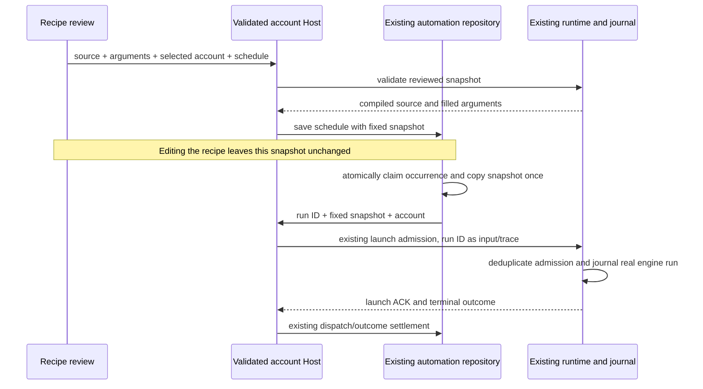

# Account-owned saved script recipes

## Approved product boundary

On 2026-10-03 the user selected recipes belonging to each account. The original migration requires adapting the existing saved-workflow engine, scheduler and history. Saved prompt templates remain useful, but do not constitute this script-engine acceptance. Recipe execution is bound to the account selected at admission, not whichever account Renderer later displays. Use current editorial profile, memory and policy through the existing Host Social Agent context contract. Supervised publication and exact-export approval remain mandatory unless the account explicitly authorizes the existing autonomous policy.

Do not create another scheduler, script engine or authoritative run-history store. The existing CLI saved-workflow store owns definitions and parsing; its dynamic-workflow journal owns engine runs, actor lifecycle and replay. The existing automation repository/scheduler owns schedules, manual/scheduled claims and dispatch history. Host owns account identity validation and routing. Renderer owns drafts and derived lists. Main continues process dispatch and message routing only.

```mermaid
sequenceDiagram
    participant UI as Account Automations / conversation
    participant Host as Account admission and routing
    participant Scheduler as Existing automation owner
    participant Agent as Existing session runtime
    participant Store as Existing saved-workflow store and journal
    participant Actor as Account-scoped workflow actor
    UI->>Host: select/save/run recipe for account
    Host->>Store: resolve only validated account recipe root
    UI->>Scheduler: optional account schedule
    Scheduler->>Host: existing owner/lease admission
    Host->>Agent: trusted account identity and recipe source
    Agent->>UI: existing visible execution approval
    UI->>Agent: approve concrete script
    Agent->>Store: journal run and immutable submitted source
    Agent->>Actor: same account tools and permission boundary
    Actor->>Host: typed media/project/context commands
    Host-->>Actor: owned facts and admitted results
    Actor->>Store: settlement and replay facts
    Store-->>UI: account-filtered history/artifacts
```

## Confirmed source gaps and implementation constraints

`core/src/runtime/helpers/tool-allowlist.ts` exposes only social tools for social-account identities. Do not broaden it to all generic workflow/coding tools. `ListSavedWorkflows` currently searches project and global roots; `SaveWorkflow` accepts global scope and a filesystem script source; `CreateWorkflow` accepts arbitrary file paths and saved global definitions. Account behavior must reject those alternate roots and paths before reading or displaying anything. Validate canonical account workspace identity through the existing Host resolver and use its private account directory. Do not touch legacy user data or migrate unrelated project/global recipes into an account implicitly.

The script runtime inherits parent identity but explicitly creates actors with `mode: "yolo"`; its dependencies currently omit Social Agent/project ports. The engine receives a native execution port separately from actor tool registration. Consequently adding workflow names to the allowlist alone would neither deliver social tools correctly nor establish a safe account boundary. Account scripts must be unable to invoke generic native execution, filesystem reads or unauthenticated network capabilities. Reuse the sandbox/driver's capability injection to constrain these; maintain nested-orchestration restrictions. Actor tool commands must receive the same trusted account ports, stale-revision/owner protections and visible permission routing as account conversation commands. No invisible waits, timeout-based bypass, or permissive fallback.

The current definition store uses synchronous filesystem calls for historical approval preparation. Extend/reuse its parser, serializer, naming rules and single storage path with asynchronous IO; resolve and validate source before the synchronous approval projection rather than creating a second parsing or approval path. New public account views must return names, metadata, script and owned run facts, not administrative credentials, other-account paths or global definitions. Saved source, arguments and any schedule linkage need strict runtime validation and one commit path. Exact public interfaces and capability seams must be finalized against the bounded source contracts before behavior changes.

## Acceptance plan

## Runtime capability interface

The existing run-service and driver dependency bags gain an optional internal `capabilityScope: "social-account"`. `create-app` derives it from the trusted runtime account identity, never script input or Renderer preference. Run launch propagates it to the same driver. For this scope, every world-read operation (`files.*`, `git.*`, `world.run`) fails with the existing structured `WorkflowError("DriverError")` before filesystem or execution ports are touched. `artifact.file` likewise fails before source lookup; in-memory markdown/chart/table artifacts and engine journal/replay retain their existing semantics. No database schema or new environment variable is introduced.

Account actors inherit the parent permission mode after persona configuration is applied. They receive the parent's injected `socialAgentPort` and `socialProjectPort` and its derived child client ports, preserving account validation, trace, root-session permission routing and existing publication/export gates. Generic workflow actors retain their current behavior. Neither persona overrides nor script-requested tool names may widen an account actor's tool surface or replace its identity/working directory. Existing structural restrictions on nested orchestration stay in force. This capability boundary must be tested before exposing saved-workflow tools or a recipe launcher to account users.

### Capability boundary tests

- Exercise every world-read operation using ports whose calls fail the test; account scope must reject without any port call, including a declared/approved `world.run` command.
- Reject `artifact.file` even with a valid artifact store and a source path inside the account directory. Preserve in-memory markdown publication and the artifact owner's parent-session association.
- Inspect actual actor runtime configuration and injected ports: account identity/directory/mode and social ports are inherited, root client permissions retain the existing derived routing, and non-account actors preserve their current mode.

## Definition and scheduling acceptance

On 2026-10-04 the user selected a fixed approved script version for schedules. Updating a saved recipe must not modify any existing schedule's executable snapshot. Replacing the scheduled version is an explicit review-and-save action, including source, validated arguments and account. Every occurrence retains the same account tools, publication gates and journal semantics. A changed recipe cannot silently increase an already approved schedule's capabilities.

### Definition store interface and migration

Extend the existing `SavedWorkflowRootsOptions` with the trusted optional `workspaceIdentity`. Host validates the identity/path pair through its existing account workspace resolver before creating a carrier or runtime. The store rejects malformed account identities. For a canonical account identity, `savedWorkflowRoots` returns only the project root beneath the validated account directory; an explicit global scope and global-to-project move are rejected before IO. Generic workspace roots and first-wins shadowing keep their existing semantics.

Existing definition IO becomes asynchronous on the same public functions (`listSavedWorkflows`, `resolveSavedWorkflow`, `saveSavedWorkflow`, `savedWorkflowExists`, `findSavedWorkflowShadowing`, `moveSavedWorkflow`). Source normalization awaits resolution before projecting the existing synchronous approval payload. The trusted identity is added to `ToolInputResolutionContext`, propagated by the executor, and checked again at the final handler boundary. Account tools accept inline script or an owned saved name, never `path`, `script_path` or global scope. Rejection precedes any source lookup, draft creation, hook or execution. Account lookup failure lists only account recipes.

Use the existing frontmatter codec and metadata/argument validation. Name validation occurs in the store before path construction on every public write, not only in a tool. Account root components and definition files must be regular, private files/directories without symbolic links or hard-linked definition files; definition reads and writes are bounded to 1 MiB of UTF-8 serialized source. Reject excessive input with an explicit error without altering existing definitions. Writes use a same-directory temporary file with mode `0600` and atomic rename; concurrent metadata and full-source writes in a process serialize at the same store owner. The protocol's metadata update and deletion use this owner rather than writing/unlinking resolved paths separately. Existing valid `.dwf.ts` files stay in place; do not import global or another account's definitions. No database change is needed for this definition-store slice.

Tests must cover two isolated accounts with the same recipe name, global exclusion without reading it, malformed identities, traversal names, symlinked directories/files, oversized source, concurrent complete writes and metadata updates, persistence through a new store read, and pre-approval rejection of path/global sources. Native execution remains denied by the previously defined runtime capability boundary.

Account runs retain the immutable source in the existing journal and do not create filesystem draft copies. Inline editing and saved definition updates use the account recipe interface; actors cannot read/edit arbitrary draft paths. Generic workflow draft behavior stays available to generic runtimes.

### Desktop recipe editor and approved execution interface

The account Automations surface gains a separate saved-script recipe section. Its hook resolves the selected account through `ISocialAccountService.resolveConversationWorkspace` and calls the existing injected Agent service. Name, description, argument declarations and inline source are editable drafts; lists and run history are projections from the definition store/journal. Do not show arbitrary filesystem targets, global scope, another account selector, or generic workflow settings. Compilation and argument diagnostics appear before a run or schedule can be accepted. Saving a definition does not authorize its execution.

Add the bounded `workflows/save` workspace RPC to the existing saved-workflow protocol, Host service and remote service contract. It accepts name, project/global scope, metadata and inline script; account scope retains the project-only rule. The core parser/compiler/store remain the owners of validation and commit. Reuse `getSavedWorkflow` for exact source review and `listSavedWorkflowRuns` for history. A direct UI save is the user's concrete write command, while model-initiated `SaveWorkflow` retains its always-ask permission gate.

Extend the existing `startSavedWorkflow` command with an optional approved snapshot rather than introducing another launch command/engine. A snapshot contains a schema version, recipe name, description, source, argument declarations and validated argument values. On an account launch, the final review supplies the exact displayed snapshot; the runtime compiles those bytes and does not reread the recipe by name. Legacy generic launches without a snapshot preserve lookup behavior. Snapshot admission rejects alternate scope, malformed account identity, invalid source/arguments and a mismatched name before creating a run. The existing blank-session launcher, command ACK, control-only launch row, engine journal and conversation transport remain the single execution path. A successful ACK navigates to the owning account conversation; rejected admission reclaims only the newly created empty session. History continuation opens the original parent conversation.

The wire value is the strict object `{ schemaVersion: 1, name, meta, script, args }`, bounded to 1 MiB of complete serialized UTF-8 JSON. Source has the same byte bound; metadata defaults and argument values must be JSON values. A snapshot launch rejects a competing top-level `args` bag. Required arguments and defaults are checked by the existing core argument validator before admission; the submitted engine source, launch projection and filled arguments all derive from that one reviewed value. Account launches without a snapshot fail before session persistence or engine submission. Generic lookup errors retain their existing diagnostics. Tests exercise the actual runtime launch method, including its control-only events and engine submission, as well as strict schema and source-resolution tests.

The bounded workspace RPC `workflows/validate` accepts `{ workspace, approvedSnapshot }` and returns either `{ ok: true, approvedSnapshot }` with argument defaults filled by the existing core validator, or `{ ok: false, reason, message }` using the launch failure vocabulary and bounded diagnostics. It performs no definition read/write, session creation or engine submission. Only canonical account workspaces can validate reviewed snapshots. The Host resolves and validates the identity/path pair before invoking it; schedule create and explicit replacement invoke it before the repository commit. Renderer cannot claim that its own validation is authoritative. Legacy model CronCreate/CronUpdate remain prompt-only; the explicit recipe review surface is the schedule authoring path.

### Schedule authoring and explicit replacement

The public Agent automation create/update inputs add optional `recipeSnapshot`. A new recipe schedule must carry an empty prompt, a canonical account identity/path pair and the reviewed value; Host verifies the pair before resolving the validator's runtime. An explicit replacement first checks the existing schedule under that workspace, rejects foreign/absent schedules and prompt-to-recipe conversion, then calls the same no-write core validator. Its filled snapshot is the sole value passed to the existing automation service. A title/time-only edit omits this field and preserves the stored bytes, including a malformed snapshot's explicit error. No administrative or filesystem credential is part of this interface. Existing prompt schedules and model Cron tools keep their current contract.

The recipe review has a separate **Schedule reviewed version** action. Host validation fills defaults before opening the existing schedule form, which displays the exact source, argument declarations and filled values, the selected account and local time zone. The final create/save action revalidates at Host before persistence. Recipe schedules have no editable prompt or prompt templates. Editing a schedule's name/time preserves its version. **Replace approved version** loads the latest owned definition for review; only the subsequent explicit approval/save replaces future unclaimed occurrences. If the definition was deleted or is invalid, explain the impediment and keep the old schedule intact. History shows the occurrence's own source and original conversation. Account switches discard drafts and ignore stale read/action/navigation completions; they never reinterpret a pending action as belonging to the new account.

Acceptance adds real-service validation before repository writes (invalid compilation/defaults, forged account/path, foreign schedule, legacy conversion and omitted snapshot), and Electron create/run-now/history/edit/replacement/relaunch/isolation using scripts with distinct return values. The history assertions read actual engine terminal outcomes and the persisted occurrence snapshots; a control-only turn or successful create response is not proof of script execution.

For manual launch, only a confirmed rejected command may reclaim a newly created empty parent. A lost or malformed ACK must retain the parent and first command identity. Reconcile through the existing command query and journal projection; evidence of accepted work opens that original parent. When neither projection is available, report confirmation as unavailable and open the retained conversation without claiming success. Do not automatically create another run or treat a transport exception as rejection. Explicit retry and cold-Host recovery remain separate acceptance work until their existing-occurrence paths are verified.

### Fixed scheduled version: storage and migration

Add nullable `recipe_snapshot TEXT` columns to both `automations` and `automation_runs` in the existing tasks-index database through a new frozen migration `0004_account_recipe_snapshot`. Keep migrations 0001–0003 and their checksum inputs unchanged; new installations also reach 0004 through the same runner. This is a services-owned database migration, not a second CLI database. Existing prompt automations and runs keep NULL and require no backfill or reinterpretation.

The strict version-1 snapshot holds the reviewed name, description, source, argument declarations and filled arguments. Account identity/path stay in the existing automation owner fields, not script-controllable snapshot fields. Save/create accepts a snapshot only for a canonical account workspace. The Host validates account ownership and the existing core compiler/argument rules before persistence, and the repository enforces the final bounded schema. A recipe automation has an empty prompt and may not fall back to prompt dispatch; prompt automations continue to require a nonempty prompt. A malformed non-NULL snapshot is an explicit execution error, never interpreted as NULL or converted to a prompt.

The existing public automation and run projections add optional `recipeSnapshot`; invalid stored non-NULL JSON instead projects the read-only code `recipeSnapshotError: "invalid_recipe_snapshot"`. This preserves list/history availability while making the execution failure explicit, without exposing raw malformed source or interpreting it as a prompt. Create/update input cannot set the error code. Snapshot replacement requires another valid reviewed value; omission preserves it, and clearing it into a prompt is not supported. SQL copies the exact stored snapshot at claim before interpreting it. The Host reads the owned occurrence from the repository, checks its account/automation identity and error code, and dispatches that fixed value; it does not trust a stale Renderer or Scheduler copy for source selection.

At manual/scheduled occurrence admission the same repository transaction copies the schedule snapshot into the run row. First copy wins for a given run ID, including NULL for legacy prompt runs; retries and reclaimed claims use that run snapshot. Explicitly replacing a schedule version changes only future unclaimed occurrences. Saved recipe edits/deletion cannot alter a schedule or an already claimed occurrence. The history projection shows the fixed source version and owning conversation; no additional run-history table is created.

Scheduled claim insertion records attempts=0 until the scheduler's existing dispatch-admission update increments it. The occurrence key uses the same timestamp priority as the scheduler: nextRunAt, then retryAt, then the claim clock. Claim recovery must not mint a different key when only retryAt is present.

The Host dispatches the run snapshot through the existing runtime launch path, carrying the occurrence run ID as launch input/trace identity so the current scheduler outcome tracker can settle the real engine outcome. Preserve existing owner/lease routing, single-flight claims, model-selection freeze, missed occurrences, pause and desktop-continuous delivery. Restart checks the existing run ID/journal before any resubmission; an acknowledged engine run must not be launched twice after a lost ACK. Mobile reads use the existing replayable conversation/history transport.

### Occurrence admission and real engine settlement

The Host must bind the occurrence to its parent conversation with a compare-and-set on the existing run row before submitting the script. The repository's `fixRunSession` operation accepts run ID, automation ID, workspace key and proposed session ID; it validates all three owner keys and returns the first bound session. Missing or foreign rows are rejected without creating one. Later dispatch ACK writes preserve that first session. Retries reuse that parent; an unavailable bound conversation is an explicit failure, never a reason to create another parent. The occurrence ID is the existing V4 command envelope's `commandId`. It becomes the internal `launchInputId` in bootstrap/runtime, not a script argument or a new Renderer-owned accepted queue. Ordinary direct account recipe launches use their existing command ID in the same path. Generic non-account workflow behavior is unchanged.

The internal submit port gains optional `admissionKey` and an optional `replayed: true` success flag. Only trusted direct account launches populate the key, using the envelope command ID. The existing run service derives a filesystem-safe engine run ID from the SHA-256 of the account directory, parent session and key. It checks its existing in-flight registry first, then the engine-owned journal. A matching admission returns the same run ID without starting or resuming an engine. A reused key with different source, arguments or recipe name is rejected before side effects. The registry retains the submitted arguments only across the submit-to-journal interval; it is not another durable admission store. The engine remains the sole writer of run rows and terminal events. No CLI database migration is introduced.

Replayed admissions do not append another control-only launch turn or install a second background watcher. Their tool-call identity is derived from the same admission key, and existing journal/history replay supplies the run projection. If a process died before any journal row, no actor or engine effect has been accepted and the retry can launch. If a row exists, a retry returns that run even when interrupted, stopped or failed; explicit resume remains a separate existing action, never an automatic scheduler retry.

The Host subscribes to the existing `workflow.lifecycle` facts before command admission and correlates account workspace, parent session and source command ID. Only the real engine's `run-settled` status settles the automation: completed means succeeded, errored means failed, and stopped means the existing stopped outcome, retaining the interruption reason. The launch turn's `TurnComplete` must not settle a recipe occurrence. After an ACK or recovered admission, the Host also reads the existing owned run projection for a terminal result that arrived before or during connection recovery. Manual claim heartbeat and release continue through the existing cron lifecycle owner. No new schedule queue, timer-based synchronization fallback, history store or engine is added.

A confirmed recipe success clears any earlier transport/confirmation error in the occurrence row. Running preserves the outstanding impediment, and failed/stopped outcomes retain their actual engine error. A late ACK still cannot clear a real terminal failure. Keep legacy prompt error projection unchanged.

Required tests exercise two simultaneous submissions before journal creation, retry after a lost ACK, a fresh service reading a terminal or interrupted journal row, conflicting source/arguments/name, distinct accounts and parent sessions, generic submissions without deduplication, one launch turn/watcher on replay, Host parent binding races, and real engine settlement rather than control-turn completion. These admission and dispatch rules are required work until their code and tests are completed; the storage migration alone does not enable scheduled recipe execution.

The isolated Electron provider fixture must distinguish ordinary execution requests from the runtime's text-only context-summary request. A summary can contain an earlier scenario marker as quoted conversation data; that must not add tool calls to the fixture's execution trace. Keep the strict read-before-write sequence assertion. Verify the mock at its HTTP boundary with both a summary containing a marker and an ordinary marked execution request; do not remove duplicate calls from observations or weaken the production assertion.

Before enabling schedule authoring, validate these Host cases through the existing account-resolved Agent service and cron lifecycle:

| Setup/event order                                                                        | Required result                                                                                                                                                                         |
| ---------------------------------------------------------------------------------------- | --------------------------------------------------------------------------------------------------------------------------------------------------------------------------------------- |
| An occurrence already has a pinned snapshot, then the definition and schedule are edited | Read source from the owned run row and launch that exact snapshot, never the current definition or schedule                                                                             |
| A run has malformed stored snapshot JSON or mismatched automation/workspace keys         | Reject before creating/resuming a session, sending a command or falling back to an empty prompt                                                                                         |
| Two dispatches race before session binding                                               | Bind one parent with `fixRunSession`; reclaim only a losing newly created empty session; admit the script only in the returned parent                                                   |
| The bound parent is missing after a cold restart                                         | Report the impediment; do not create a replacement parent or automatically resume another run                                                                                           |
| The control-only launch turn ends while the engine is running                            | Keep the occurrence running and the manual claim leased; no succeeded history yet                                                                                                       |
| The engine settles before its launch ACK                                                 | Preserve the actual engine outcome and error when recording the later dispatch ACK; do not overwrite it with running or clear its error                                                 |
| A transport error loses the launch ACK while the engine has accepted work                | Read owned journal-backed run summaries, correlate the immutable launch tool-call ID and reuse the same occurrence/parent on recovery; an uncertain ACK is not proof that no script ran |
| A fresh Host reconnects after the engine stopped or completed                            | Read its real terminal status and settle existing history; do not start or automatically resume an engine to obtain another notification                                                |
| Another account's lifecycle fact, another session, or another source command ID arrives  | Ignore it; only the owned workspace emitter plus session and occurrence identity can settle this run                                                                                    |

The existing `conversationWorkflowRunsV4` query exposes journal-backed `runId`, `toolCallId`, status, stop reason and bounded failure details. Correlate the direct launch tool-call ID; do not reproduce the run service's hashing algorithm in Host. The existing `workflow.lifecycle` notification carries the session and source command ID and is delivered through the workspace-scoped `onDynamicConversationTelemetryFact` emitter. These are read projections of the same engine journal, not another outcome store. Keep desktop continuous dispatch and mobile replayable reads on their existing transports.

The bounded Host dispatcher validates the occurrence owner tuple and fixed snapshot before any conversation side effect. It reuses the existing target services, model selection and task create/resume/config path, binds the parent with the existing repository CAS, then installs the engine tracker before sending the existing `startSavedWorkflow` command. A bound parent is always resumed; only a newly created losing empty parent is reclaimed. Reconnection first queries the existing run projection; matching running or terminal journal evidence skips resubmission. If a transport exception loses the ACK, query that same projection again. Matching evidence is admission success; confirmed command rejection without evidence is failure; a transport exception without evidence remains explicitly uncertain. Retain the tracker and claim during uncertainty. A retry uses exactly the same occurrence and parent, never a new key or automatic engine resume. No timers substitute for the engine's terminal facts.

Direct admission ACKs must name that occurrence's command ID. An accepted or rejected ACK for another command cannot confirm or reject this run, release its claim, or discard its parent. Reconcile the bound journal first; when no matching evidence is available, preserve the occurrence as confirmation unavailable. Acceptance covers both mismatched accepted and mismatched rejected replies, with and without owned journal evidence.

Host-to-Main and Main-to-Scheduler cron results add optional `admissionUncertain: true`. It applies only to a failed confirmation, not a rejected command; validation rejects the flag combined with `ok: true`. Main only forwards it. Scheduler preserves the claimed manual occurrence and its claim rather than declaring dispatch failure or releasing it; scheduled occurrences retain the existing transient retry path with the same occurrence ID. Live engine settlement can still complete history while confirmation is unavailable. Prompt dispatch and old results without the flag retain their existing settlement behavior. The Host retains recipe subscriptions in its existing cron disposable registry and removes them after terminal settlement; shutdown disposes them through the same registry.

The timed native acceptance exposed a remaining transport guard: `hostCronRunMessageSchema` required a nonempty prompt and discarded fixed recipe dispatch before Host admission. Keep the existing Scheduler/Main message and occurrence key; allow an empty prompt only with a canonical account identity. Host must still resolve the existing owned run and its valid snapshot before any session side effect. An empty prompt with a NULL snapshot is a explicit rejection, never a recipe inferred from its name or an empty prompt turn. The strict transport and actual Main router regression must cover empty canonical account dispatch, rejection for generic/malformed/missing identities, unchanged legacy prompt dispatch and the central Host-message union. No new script-source field, scheduler, queue or business owner is introduced.



Migration failure rolls back both columns and the migration ledger in the runner's existing transaction. Before downgrading to a version that does not understand snapshots, stop all Hosts and disable every recipe automation in the new version; older binaries must not be used to run or edit recipe schedules. Prompt schedules remain compatible with the additive columns. Restore a pre-upgrade database backup for a full downgrade; this discards post-backup history and schedules, so preserve/export needed history beforehand. Do not automatically drop columns, strip snapshots or turn recipe source into prompts.

Acceptance covers upgrading a populated v3 fixture without changing prompt rows, migration checksum/reopen/idempotency and rollback, two accounts, invalid/oversized snapshots, fixed version after recipe edit/restart, explicit schedule replacement affecting future occurrences only, manual/scheduled claim races, stale claim recovery, lost ACK deduplication, real journal settlement, denied actor operations and account-filtered history. Electron scenarios cover editing/reviewing/running a recipe and returning to its conversation, relaunch persistence and scheduled version replacement.

### Run access and parent tool exposure

The existing run service receives `accountWorkspacePath` together with its trusted capability scope. Resolve run membership from the owner's in-flight registry first and existing journal second, retaining the submit-to-journal interval. Reads by ID, event/artifact reads and list queries must match this account directory before reading detail or bytes. Unknown and foreign IDs have the same absence response. Submit validates both account directory and parent session before launching. Resume/amend additionally require the original parent session; another conversation may inspect account history but opens the owning conversation to continue a run. Existing owner, replay, residency and terminal handling remain unchanged. Generic runtimes preserve their existing scope.

Expose only `ListSavedWorkflows`, `SaveWorkflow`, `CreateWorkflow`, `ListWorkflowRuns`, `GetWorkflowRun`, `ResumeWorkflowRun` and `ResolveWorkflowQuestion` to canonical account parent runtimes. Account actors retain the social tools and safe submit/escalate controls, without nested orchestration. Save/Create retain their existing always-ask approval gates; scope/source validation precedes that gate. Describe account-only sources and denied world/filesystem/native capabilities to the model. The account feature does not depend on the retired generic workflow settings UI; generic runtime rollout remains unchanged. The same allowed/disallowed helper and account descriptions apply to initial registration and branch refresh.

- Save/list/read/update a valid account recipe, reject invalid names/arguments/scripts before execution and retain definitions across relaunch. Global and second-account definitions, arbitrary paths and alternate workspace identities are inaccessible.
- Run the actual saved script with the existing engine through an account conversation. Show execution and tool permissions in the selected account; denial cannot create/edit/export/publish. Actor tools are only the account tools plus safe engine control; attempted native execution/filesystem/network access fails before side effects.
- Reuse existing scheduled/manual admission and history. A claim creates at most one engine run; pause, missed-run behavior, interruption/replay, stale ownership and disconnected windows retain current semantics. No second queue or synthetic successful history.
- Verify measured source discovery and clip preparation to completed exact-revision export. Publication still requires the existing approval/current-export gates. Run account-isolation, relaunch, denial, actor-permission and scheduler scenarios in Electron, plus meaningful driver/store/protocol tests and root typecheck/lint/architecture checks.

## Executed validation and remaining scope (2026-10-05)

The isolated Linux Electron recipe scenario passed all three app starts: creation/editing, rejected compilation preserving the saved source, exact review, actual script-engine execution, owning-conversation navigation, journal history, durable relaunch and a second account without access to the first account's recipe. The scenario uses an isolated data root and local model fixture, with no real Meta publication. The main account Electron suite now includes these checks. Its first expanded attempt reached recipe execution and visual export, then failed a strict candidate tool sequence: the mock counted context-summary requests containing quoted scenario markers as execution calls. Isolated model-IO evidence confirmed the duplicate entries were summary responses. The mock was fixed and its HTTP regression passed. The second expanded attempt failed the 30-second first-permission wait: isolated runtime evidence shows the first read-only context query completed, while the second model iteration began immediately before test cleanup; the mutating command that requests permission had not yet been emitted. This is not a passing integrated result or evidence of a bypassed permission. Keep the failure visible and rerun the unchanged assertions when validating the next implementation.

The reviewed launch/core/protocol/admission tests passed 20/20, including the no-write validation RPC with filled argument defaults, V4 command identity forwarding and actual engine execution exactly once across duplicate submissions, a lost-ACK retry and a cold service reading its journal. Conflicting reviewed inputs, two accounts, invalid keys and generic independent launches are covered. Strict snapshot and automation storage/admission tests passed 16/16, including populated v3 migration, unchanged prior checksums, transaction rollback, claim races, retry-only occurrence keys, malformed JSON, explicit replacement affecting only future occurrences, reopen durability and scoped first-wins parent binding despite a late ACK. The existing account capability/store/source/access regressions passed 37/37 and the HTTP mock regression passed 1/1: 74 focused cases in total.

Root and internal Agent typecheck/lint passed. Root lint retains 54 warnings; the full Agent log contains 59 warnings across all packages, including cached shared/runtime tasks, with zero errors. The initial root lint exposed the mock file exceeding the 400-line gate; summary planning and common tool-result parsing were extracted into bounded fixture helpers, then lint passed. Root formatting and changed architecture checks passed (zero violations).

The manual recipe interface, fixed-version storage, repository parent binding and trusted account engine-admission deduplication are implemented. The existing Host dispatcher now branches on the owned occurrence snapshot, binds/reuses its parent, sends the stable command ID through the account-resolved Agent service and tracks engine facts/journal rather than the control turn. Bounded dispatch and tracker tests passed 14/14; uncertainty contract/manual claim tests and existing cron routing tests passed another 6/6. Three new storage regressions passed after fixing late dispatch ACKs that cleared a real terminal error and changed a manual run's bound parent, and clearing an earlier confirmation error only after confirmed recipe success. The final combined storage/Host/protocol/mock run passed 40/40; with the earlier core/admission and account boundary cases, 97 focused cases passed across the validated slices. This does not establish an integrated scheduled-recipe Electron pass.

The final focused Linux Electron recipe run passed again on the current source with three app starts, using an isolated `/tmp` data root: save/edit/rejected compilation, exact review, actual engine execution, parent navigation, durable history after relaunch and a second account with no recipe/history access. This current-source pass is limited to the manual recipe flow; it does not replace the failed expanded account suite or prove scheduled recipe execution.

Public schedule create/update now accept the reviewed snapshot and validate it through the same core RPC before repository commit. The account interface can create a fixed recipe schedule, review/replace its future version and inspect each occurrence's source/history/conversation. Title/time edits omit replacement. Six focused validation cases passed, including the actual public service rejecting forged account paths, foreign schedules and legacy conversion before any runtime spawn. Five automation draft cases, five launch-confirmation cases, thirteen snapshot-storage cases and five Main routing/strict transport cases passed: the current combined run passed 34/34. Standard root typecheck/lint, formatting and changed architecture passed; root lint retains 54 warnings. The manual launcher now reconciles lost ACKs through the command query and journal, retains uncertain parents and ignores stale account navigation. Full explicit retry of an unresolved command remains required.

Further regressions first reproduced failure and then passed after correction: mismatched occurrence ACKs, history-bearing compact requests and continuation with completed read facts after the summary. The final combined current-source run passed 47/47 across the above 34 cases, ten Host occurrence-dispatch cases and three provider HTTP cases. Root typecheck, lint/pre-push (54 warnings, zero errors), formatting and changed architecture (zero violations) passed again after these changes.

The expanded native Linux recipe scenario passed on the current source with three app starts: creation, both manual version executions, explicit replacement, actual timed Scheduler/Main/Host dispatch using the second approved version despite a later definition edit, durable history, relaunch and isolation. Initial attempts failed on fixture selectors and the provider-free startup precondition; actual timed dispatch then exposed the empty-prompt transport rejection described above. After fixing that confirmed cause, the unchanged timed acceptance completed with the real engine outcome. The fixture used only its isolated data root and local model; no real Meta publication was executed. Complete cold-Host settlement of already-dispatched occurrences and explicit same-occurrence retry remain required before recovery is complete. This native recipe pass does not replace the failed full account suite or establish Windows/macOS acceptance.

Hosted CI 37256929709 at commit 36e2667 passed static checks and the bridge container smoke, but all three account Electron jobs failed the candidate tool-sequence assertion with repeated read calls. The prior summary-mock fix did not establish an integrated pass. A new failure diagnostic records only isolated fixture request roles, sizes and tool associations to investigate this sequence; it does not filter duplicate observations or weaken the assertion. The expanded suite remains failed. Real Meta publication and strict production release materials remain independent acceptance gates.

The current isolated rerun reproduced that strict sequence failure after successful exact-revision visual/audio export checks. Request-shape evidence shows three actual compact requests containing conversation history followed by the final text-only user instruction. The mock's one-message compact predicate excluded this real provider shape and planned another candidate tool for each summary request. Recognize compact intent from the final user instruction before scenario planning, whether or not history precedes it. Cover both provider shapes at the HTTP boundary, preserve ordinary tool planning and the exact integrated tool-sequence assertion, and rerun the native suite before reporting an integrated pass. The fix must not raise the context budget or remove duplicate observations.

The corrected compact predicate reached a real compact boundary, but the generic fixture summary discarded the current request and completed read facts; the next five-message provider request then stopped before the mutating permission. The deterministic fixture summary must retain the latest configured scenario request and only its actual completed tool results from the supplied history. Carry these facts in a bounded fixture-only summary payload and read them through the same tool-result collector alongside the retained live messages. Do not use model-server progress caches, fabricate results or mutate production compaction. HTTP acceptance must exercise summary followed by a pending tool result and verify that the next planned call uses those owner-provided facts without repeating earlier reads. The full Electron suite remains failed until its unchanged permission and sequence checks pass.

The next native attempt passed the candidate permission/sequence checks and reached conversation production, where a separate inline result parser ignored the compact facts and repeated the initial account/media reads after actual export polling. Production and preparation planning must use the same fixture result collector. Summary payloads have a 256,000-character rejection bound; preserve the latest supplied result for each tool, including retry evidence, instead of copying every obsolete job-poll observation. Cover production continuation after an admitted import, and latest job state preservation, without changing the native 90-second acceptance window or reporting unfinished exports as completed.

The shared-collector correction passed 49/49 focused cases and root typecheck, lint/pre-push, formatting and architecture. The fourth full native attempt failed before submitting the resumed project-edit prompt: its Lexical state did not equal the injected fixture text within the existing 30-second assertion. This does not establish a product cause. Before changing editor behavior, record only fixture editor/bridge identity, connection state, text lengths and equality checks at that failure boundary. Keep exact text, permission and tool-sequence assertions and their existing deadlines unchanged; do not retry draft writes or fabricate an accepted submission.

The final expanded Linux account Electron run passed on 2026-10-05 under an isolated virtual display and data root. It retained the strict candidate tool sequence and actual permission gates, completed conversation production and manual clip-template execution, checked same-time visual/audio preview-export parity, exercised on-demand proxy generation and original-only export, then reopened the app and verified durable account, recipe, media/project and proxy state with an unchanged legacy sentinel. The prior Lexical draft failure remains without a confirmed product cause; diagnostics stay fixture-only. This local integrated pass does not establish Windows/macOS acceptance, cold-Host recovery, full agreed multitrack parity or a real Meta publication.

After Host wiring, standard root typecheck passed on the final retry, root lint passed with 54 warnings and zero errors, formatting passed and changed architecture passed with zero violations. Two prior root typecheck attempts failed with disk-write `ENOSPC`; 72 old generated test fixtures were cleaned while preserving recent failure evidence, and the ignored UI incremental cache containing the write failure was removed before the passing retry. The internal Agent's typecheck/lint passed again. The additional Main/Scheduler TypeScript build failed with 89 diagnostics across 27 existing files, including browser/platform code, missing storage exports and the off-peak submission at `scheduler/index.ts:244`. A subsequent no-emit comparison against an isolated copy of the Main/Scheduler sources and scripts from commit `36e2667` reproduced all 88 current Main and one Scheduler diagnostic locations/codes in that baseline. No new diagnostic location/code was found in these two checks. This bounded comparison shares the current upstream dependency declarations; it is not a clean historical build or a passing additional typecheck.
