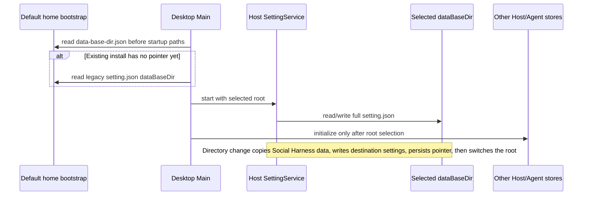
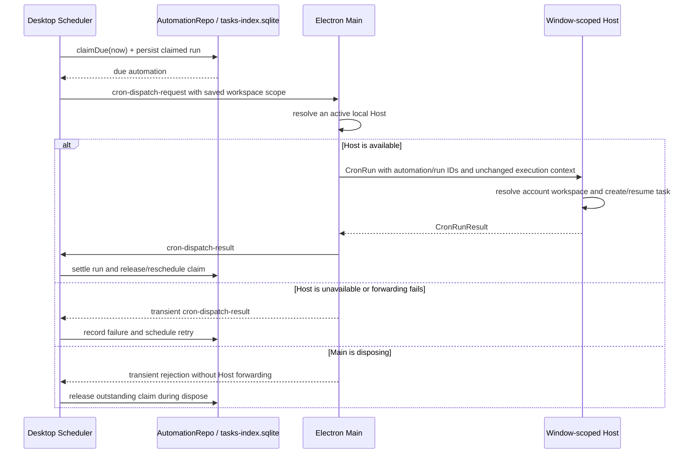
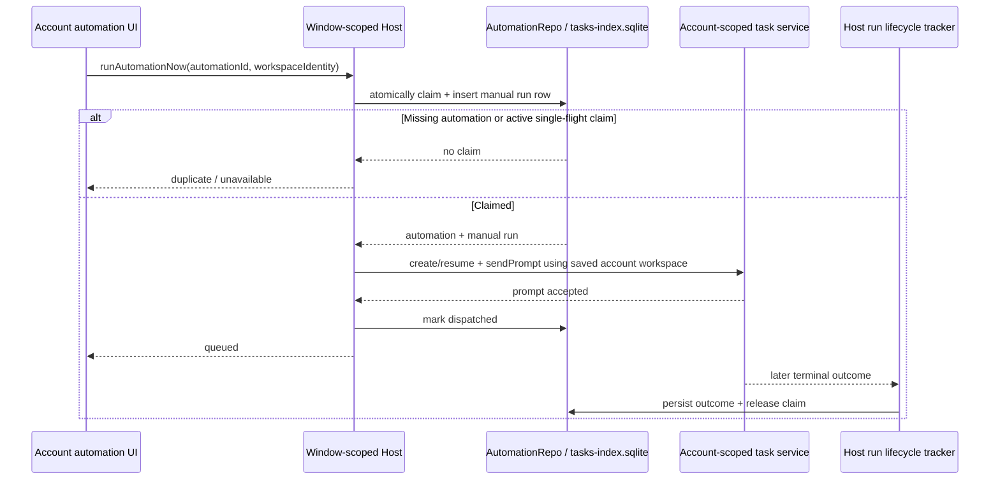

# Social Harness migration specification

## Purpose and release boundary

Transform this repository into a desktop application for creating and publishing social video through an AI agent. The pilot flow is account setup, editorial direction, source discovery, collaborative editing, review, approval, and Instagram Reel publication. Podcast and music are the initial acceptance cases; the editorial profile remains usable for other niches.

The first product release targets Electron on the operating systems supported by the existing desktop packaging pipeline. Desktop remains the runtime owner for media processing and scheduled work. Web/mobile code must not expose the retired programming product UI; a functional web editor is not part of this release. Preserve existing host attachment, workspace identity, owner/lease, and remote replay boundaries where shared infrastructure remains in use.

The first release does not include public conversation sharing or imported-share previews. Remove the share composer flow, public `/share` routes, and their Z.ai/BigModel Web OAuth callbacks from the Social Harness product. This feature depends on ZCode's remote identity and share service, while the Social Harness release defines neither a Web identity nor a remote conversation-share owner. Do not call the legacy conversation-share API. Old `/share` and `/cn/share` links, including callback URLs, display a localized retired-link notice, clear the browser URL to `/` (discarding legacy `code`, `state`, and fragment values), and do not initialize Web bootstrap or call any application, OAuth, or share API. A social-account workspace must not read or render an imported share context or publish a conversation share. Reintroduce sharing only through a separate product contract for identity, audience, expiry, content and attachment disclosure, revocation, and public hosting.

## Product behavior

- Primary navigation is Accounts, Conversations, Library, Player, and Automations.
- All active Social Harness surfaces use the Social Harness product name and identity. The Windows custom titlebar must not present a model-provider logo as the application brand; its visible brand is the established “Social Harness” name.
- Development-only diagnostics and internal Browser Use or prompt-trajectory guidance describe the current runtime as Social Harness; user-visible titles, downloaded artifact filenames, and prose do not call it ZCode. Preserve historical spelling only in internal source/API identifiers that remain part of the implementation.
- The retained headless CLI's localized help is owned by `@social-harness/i18n` and describes `app-server` as the Social Harness Agent stdio server. `ZCode Protocol` remains an internal protocol identifier and does not appear in command help.
- If the Social Account service is unavailable, every platform shows the Social Harness unavailable surface; the desktop must never fall back to the retired programming shell.
- Accounts is the local-first launch surface and remains usable without Instagram authorization or model-provider login. A prepared account can be created and edited before either connection exists.
- All device-global Social Harness state belongs under `<dataBaseDir>/.social-harness/v1` (defaulting to the isolated user's home directory). This includes Desktop settings and logs; headless Agent session database, config, logs, execution outputs, workflows, skills, commands, plugins, MCP settings, hooks, and subagent state; crash archives; and temporary attachments. Desktop, Host, and Agent resolve the same root. No startup path or feature fallback may read, import, or create files beneath the legacy user `~/.zcode` root; changing `dataBaseDir` copies only Social Harness-owned data, never the legacy root.
- Project Memory files written by the headless Agent use `<dataBaseDir>/.social-harness/v1/cli/memories/projects`; the service catalog and preview use that same CLI storage root and never fall back to `~/.zcode`.
- The Social Harness shell provides a reachable model-provider settings entry. It reuses the Host's existing provider-settings owner and personal-provider contracts, which are app-wide and independent of social-account state. Social Harness exposes direct user-configured API-key providers and their model configuration; account/OAuth-backed provider entries are filtered out of both the settings view and provider-template picker. Requests identify as Social Harness and omit an HTTP Referer by default. A maintainer may set `SOCIAL_HARNESS_PROVIDER_REFERER` to a validated HTTP(S) origin when a provider integration requires one. Headless Agent WebFetch and GitHub archive requests identify as Social Harness and do not send a ZCode hostname or coding-CLI product identifier. The shell does not mount or construct the retired Z.ai/BigModel OAuth adapters, generate their `zcode://oauth/callback` redirect, or expose Coding Plan inventory/upgrade UI, purchase, entitlement, or provider-configuration API flows. The product has no default first-party API origin: any optional Social Harness service requires an explicit origin, and an absent or retired ZCode origin disables that request locally. Personal API-key model requests always use the user's configured provider endpoint, even when a Social Harness service origin is configured. Instagram authorization is the only account OAuth flow in this release and uses the Social Auth Bridge; the generic ZCode OAuth runtime has no providers. A user can configure the model before opening an account conversation, while account creation remains available if no model is configured.
- Desktop Main and preload have no handlers for the retired ZCode payment callback or embedded purchase WebView, and local and remote Host registries do not construct or register the Coding Plan subscription/entitlement, client-scenes, or conversation-share services. Desktop does not forward old `social-harness://share/import` links. Keep the OAuth callback route used by Instagram's Social Auth Bridge, internal agent execution, and user-configured model-provider credentials; none restores the retired ZCode product flows.
- Confirmed first-release decision: support account creation and editing of the account name, editorial profile, and automation policy, but defer account deletion until conversations, media, projects, automations, credentials, and publication records can be cleaned up together without orphaning data.
- Account records own editorial and automation data only. Instagram handle and connection presentation are owned by the social publishing service; legacy account JSON fields for those values are ignored when read.
- Each social account has isolated conversations, projects, editorial profile, preferences, and permissions. Accounts can be prepared locally before connecting Instagram.
- The profile contains niche, audience, language, tone, references, preferred sources, and visual style. Learned preferences are visible, editable, and removable. The agent cannot grant itself capabilities or expand account policy.
- Podcast discovery evaluates context, complete phrases, pauses, and clip potential. Music discovery uses audio structure, rhythm, and visual samples without requiring speech transcription. Candidates include timestamps and reasons. Missing subtitles or heatmaps are represented as unavailable data, never invented facts.
- Every account-scoped Agent session receives stable guidance to read the current account context before ranking clip candidates, compare measured evidence against the editorial profile and available outcomes, and distinguish measurements from editorial judgment. The guidance contains no account facts; the Agent reads live profile, memory, media, and publication data through the account-scoped Social Harness tools. This product guidance remains present when a session has a custom system prompt.
- The account-scoped runtime identifies its model-side persona as the Social Agent and does not inject the retired ZCode coding-agent identity or terminal-only coding-agent instructions into default or custom-prompt sessions. Stable Social Harness account guidance remains present in both cases.
- Headless Agent WebFetch requests identify as Social Harness with `User-Agent: Social-Harness-WebFetch/0.1`; they do not advertise a ZCode hostname or coding-CLI product. Existing Host egress, redirect, and response-size controls remain authoritative.
- The account conversation composer names the Social Agent and describes social-content work. In an account workspace it does not display the retired ZCode brand, the generic CLI slash catalog or goal/workflow shortcuts, skills/subagents, plugin/file/session mention catalogs, or the legacy draft-suggestion surface; these do not belong to the account-scoped Social Agent capability surface. That suggestion surface calls the retired ZCode `/api/v1/client/scenes` API and may expose ZCode plugin asset URLs, so account drafts show no suggestion slot until a Social Harness-owned catalog is specified. Natural-language prompts and the Host-resolved Social Harness tools remain available. Initial draft restoration must not overwrite text entered after the composer becomes editable, even when restoration is still scheduled for the next frame.
- The account conversation composer renders without the retired Coding Plan purchase/upgrade provider. The Social Harness shell does not mount that provider, and model controls must not require its context or expose upgrade actions without an owner. When no personal provider/model is configured, the account composer explains that setup is needed and offers only the existing Model Settings action; it opens the Social Harness model-provider view and does not suggest provider login or a Coding Plan purchase. If a preferred model is configured after an account draft was opened, a draft without an explicit model selection adopts the Host's current preferred selection when its model-selection view updates; an explicit draft selection remains authoritative.
- Social Harness does not expose an embedded interactive PTY/shell panel or a control that opens one, and its Desktop/Web bundles do not ship `node-pty` or xterm terminal UI assets. The internal headless Agent still runs non-interactive managed processes through Host services for agent and media work; on Windows, its existing `integratedTerminalShell` runtime preference remains available to headless execution. These process capabilities are not a user-facing terminal.
- Desktop's capability-gated local media preview uses the `social-harness-media://` scheme. Main owns the short-lived path registry; URLs use opaque capabilities and never grant arbitrary renderer-selected file paths.
- The Social Harness shell does not expose repository status, branch/worktree controls, code-review or Git-diff panes, programming commands, or an arbitrary workspace file browser/code editor; its root does not initialize the retired code-diff worker pool. Keep read-only previews for supported media and social-content documents, and retain Host file access required by agent and media processing.
- Desktop does not expose generic “New task” or “Open workspace” commands, arbitrary-folder startup arguments/deep links, or the retired Finder/Explorer “Open in ZCode” actions. Startup does not resolve saved generic `recentProjects`/`lastWorkspaceSession` into Host warmups; it creates only the app-managed default runtime directory needed to initialize the headless Agent's storage. That directory is not an active workspace or account conversation; a conversation starts only after selecting its account and always resolves the account-owned workspace. At startup, remove only the exact legacy Finder workflow at `~/Library/Services/Open in ZCode.workflow` when its `Info.plist` still identifies `dev.zcode.app.finder-open-workflow`, and only the two known Windows per-user keys `HKCU\Software\Classes\Directory\shell\ZCode.OpenInZCode` and `HKCU\Software\Classes\Drive\shell\ZCode.OpenInZCode` when their command values contain the legacy `--open-workspace` marker. Leave unrelated menu entries, user files, and all `.zcode` data untouched.
- Every user-visible application or native permission-panel title/copy uses the Social Harness identity; product copy must not present the retired ZCode brand.
- Assistant text that happens to contain a structured code-review directive stays visible and searchable as ordinary conversation text; the renderer does not turn it into review cards or navigate to source lines.
- Adapt the audio-first candidate selection and on-demand visual inspection ideas from [video-use](https://github.com/browser-use/video-use), but keep all edits in the Social Harness project service. Do not add its standalone coding-agent workflow or hosted transcription setup as a runtime dependency; local Whisper remains the transcription path. If source code is copied, preserve the upstream MIT notice.
- Sources are YouTube search, URL, and local files. Preserve source originals and record provenance, metadata, available subtitles, transcripts, proxies, and exports; keep unsaved candidate suggestions transient rather than catalog facts.
- Local-file intake starts through the native file picker only when `IPlatformService.canSelectFilePath` is true, then is committed by the Host media service. Accept supported audio, video, and image files; copy the original bytes into managed storage scoped by account, and record the original filename, media kind, byte size, checksum, import time, and source kind. Never alter or remove the user's source file, persist its absolute source path, or expose storage paths to the renderer. A cancelled picker changes no state; invalid files or failed copies leave no catalog entry or managed partial file. The catalog emits its change only after the copy and metadata are durable. Clients without native paths may read the catalog but cannot submit a local path.
- YouTube search is an explicit, account-scoped action from the Library. Trim and validate a query up to 240 characters, request at most ten flat video results from `yt-dlp`, and return only validated video ID, title, channel, duration, view count, and upload date when those fields are present. Construct canonical URLs from validated video IDs; never accept extractor-provided URLs as download targets. Search must not download media, write the catalog, or emit a catalog event. Empty optional metadata remains `null`; rejected or unavailable results are never invented. Run without user config or cache and surface missing-tool/network failures as retryable UI errors.
- Media jobs are local, cancellable, observable, and restartable. The Host media service is the only owner of the account-scoped queue, job state, managed files, and catalog. Accept YouTube search results, one supported HTTPS source URL, and local files. YouTube URLs from `youtube.com` or `youtu.be` are normalized to a canonical watch URL and reject playlists, credentials, non-HTTPS schemes, unknown hosts, and malformed IDs. Other source URLs use a supported yt-dlp extractor; reject URL credentials, fragments, non-HTTPS schemes, and query keys that conventionally carry credentials. Run yt-dlp without user config, cookies, cache, or playlist expansion. Every downloader HTTPS request, including redirects and media/CDN requests, goes through a short-lived loopback-only CONNECT proxy that resolves and pins only public unicast addresses on port 443; reject loopback, private, link-local, reserved, and malformed destinations. This prevents a pasted source or extractor redirect from reaching the user's router or local services. Admit one job per account and canonical source URL using a stable source key, then serialize jobs in the Host. Persist the job before it is queued, checkpoint progress at most once per second, and emit job events only after persistence. Cancellation and Host shutdown terminate and await the owned process tree and close the temporary proxy. On restart, queued jobs remain queued and interrupted downloads/finalization/transcription return to the queue; yt-dlp resumes partial media, and an already-finalized asset resumes by its `mediaId`. Cancellation and failed downloads remove completed staging outputs and temporary metadata/subtitles while preserving only resumable `.part` files; once an original is committed to the library, cancelling or failing transcription preserves that original for retry. Failed and cancelled jobs require an explicit retry. A duplicate request returns the existing job or completed asset and never creates a second download. Verify outputs remain regular files inside the managed job directory, then atomically persist the managed original, allowlisted source metadata, validated heatmap, and job state `transcribing` with its durable `mediaId` before emitting catalog change. The transcript and final `completed` job state are committed together after analysis. Request available subtitles for the account's primary BCP-47 language and English, retaining at most four validated tracks. Raw yt-dlp info JSON is temporary and removed; it is not catalog data. Raw source URLs are never logged or returned to the Social Agent. Download failures preserve a retryable job without exposing local paths.
- Media jobs use a valid non-empty timed subtitle track matching the account language, then English, before local transcription; absent, empty, or unparsable tracks trigger transcription. The default model is multilingual Whisper `small`; users may choose another supported multilingual model (`tiny`, `base`, or `large-v3-turbo`). The Host persists the selected model globally, downloads model files into the Social Harness data root during setup, verifies the pinned SHA-256 and expected byte size before atomic installation, and never exposes model paths. Whisper runs locally through the Host after FFmpeg extracts mono 16 kHz audio. The transcript stores language, provenance, model ID when applicable, and validated timestamped text segments; images are not transcribed and music discovery never requires speech. If the local runtime or model is unavailable, the original remains in the library and the failed job can be explicitly retried after setup.
- The Library exposes app-wide transcription model selection, install progress, integrity/download errors, and cancellation without revealing storage paths. Subtitle-backed jobs do not require users to install a model; local Whisper runs only when no acceptable account-language or English subtitle is available.
- Candidate analysis is an explicit, account-scoped, read-only request against a managed audio/video asset. The Host builds a deterministic evidence-bound shortlist; the account-scoped Agent then evaluates context and clip potential against the current editorial profile, relevant content history, and explicit corrections, returning at most five timestamp ranges with evidence-grounded reasons. Podcast analysis requires transcript evidence and considers complete phrases, pauses, and heatmap overlap when present. Music analysis does not require or invent speech; it considers locally measured audio energy/rhythm and, for video sources, sparse low-resolution frame-change samples. The Agent may assess editorial fit, but cannot invent timestamps, transcript, subtitle, heatmap, or media-signal facts. Every evidence field is explicitly absent when unavailable; if a mode lacks its required source signals, return no candidates with a reason. Image-only assets are unsupported. Candidate durations are 15–60 seconds. Suggestions remain transient and require user review; semantic ranking may vary with the configured model.
- The editor supports multiple video, image, text, and audio tracks; trim, split, reorder, crop/frame, speed, editable captions, mixing and volume, transform keyframes, fade/dissolve transitions, preview, history, undo/redo, and export. V1 color adjustments apply per video/image clip: brightness offset from -1 to 1 (default 0), contrast and saturation multipliers from 0 to 2 (default 1), and hue rotation from -180 to 180 degrees (default 0). The preview and exported file apply the same adjustment values; older clips without values render with neutral defaults. Caption layers preserve authored newlines and do not auto-wrap; text outside the project frame is clipped consistently by preview and export. Caption layers are transparent outside their glyphs and must reveal lower visual tracks; text rasterization preserves alpha through export compositing. Color values are not keyframable, and audio/text clips do not accept visual adjustments.
- Timeline zoom, playhead selection, snapping guides, moving, and trim handles are renderer-local gesture state. Each gesture captures the accepted project revision at its start and submits that same expected revision, so an intervening Agent edit is rejected and the accepted project is reloaded instead of being overwritten. Move previews may snap to the playhead and other clips' boundaries; release submits exactly one revisioned `move-clip` command, while cancel submits none. A start trim moves the clip start and adjusts its source start or text duration while preserving the opposite end; an end trim adjusts the source end or text duration while preserving the start. Trim deltas are quantized to project frames, scaled by media playback rate, and clamped to a nonnegative timeline start, at least one project frame of remaining media, the text duration limits, and known media duration. When a non-image media duration is unknown, the timeline permits inward trimming only. A trim preview remains renderer-local; pointer release submits exactly one revisioned `put-clip` command, pointer cancel submits none, and keyboard arrows on a focused trim handle change one frame. The Host validates media references and expected revision before persistence.
- The timeline's 88 px track-name column remains fixed at the left edge while the ruler and track contents scroll horizontally. Ruler virtualization measures only the scrollable content area to the right of that fixed column. Acceptance verifies track names remain in the viewport after scrolling to the far end and that only the visible ruler ticks plus buffer are mounted.
- Supervised publication is the default. Per-account autonomy is opt-in and requires configured allowed sources, cadence, and publication limits. The agent cannot edit those rules. For any automated publication request, the Host resolves every media asset used by the exact exported project revision and checks its persisted source provenance; unknown provenance fails closed. In supervised mode, the Host durably records an approval-required proposal bound to the export hash, revision, and caption, and makes no Meta request until the user explicitly approves it. In autonomous mode, the Host re-reads the saved policy while holding the account publication lock, rejects disallowed sources, limits automatic publications to one per 24 hours/days, seven days/weeks, or 30 days/months according to cadence, and enforces `maxPublicationsPerDay` over a rolling 24-hour window before creating a publication attempt. Connection/token projection inside this lock must use the lock-aware read path without acquiring the same non-reentrant account lock again. Pending, active, or uncertain attempts reserve capacity; uncertain remote results always require reconciliation and are never retried automatically.
- Instagram scope is connection, profile, media listing, and Reel publication. Comments, messaging, advanced analytics, and other networks are deferred.
- Automations reuse the existing scheduler. They select an account and saved discovery, clip-preparation, or publication workflow. Execution uses the current profile and policy. Supervised runs wait for approval; autonomous runs publish only within the saved policy. Desktop must be active. Use local time and preserve the existing five-minute misfire behavior: missed occurrences are recorded as skipped.
- The CLI is an internal headless Agent/runtime entry point used by Desktop and server orchestration. Do not ship an interactive TUI or a standalone CLI/Web distribution as a Social Harness product.

## State owners and boundaries

| State                                                            | Authoritative owner                                 | Persistence and access                                                                                                  |
| ---------------------------------------------------------------- | --------------------------------------------------- | ----------------------------------------------------------------------------------------------------------------------- |
| Social account, editorial profile, policy, learned preferences   | Social account service in the window-scoped Host    | Host-owned local database; account-scoped service contract                                                              |
| Instagram identity, connection status and publication capability | Social publishing service in the window-scoped Host | Account-scoped Host state; connection status is derived from the OS-secure credential entry and verified profile        |
| Instagram access and refresh tokens                              | Electron Main OS credential adapter                 | Encrypted with Electron `safeStorage` and kept out of Renderer RPC, Agent context, logs, and account JSON               |
| Conversations and agent runtime                                  | Existing Host/session services                      | Existing session persistence, scoped to the account workspace                                                           |
| Media catalog and processing jobs                                | Media service in Host                               | Account-scoped local catalog plus managed media files; one durable serialized queue supports recovery                   |
| Transcript segments and provenance                               | Media service in Host                               | Persisted on the account-scoped media asset; accepts only validated subtitle cues or local Whisper output               |
| Candidate-analysis evidence and semantic suggestions             | Media service and account-scoped Agent in Host      | Bounded evidence read plus read-only profile/history context; suggestions are transient and never catalog state         |
| Whisper model selection and installation                         | Transcription model manager in Host                 | App-wide private model directory, selected-model record and durable download snapshot; cross-process transfer lock      |
| YouTube search query and result projection                       | Library renderer                                    | Transient and account-scoped; Host validates and searches without catalog writes                                        |
| Model provider credentials, endpoints, and models                | Existing provider runtime in the local Host         | Existing provider-settings contract and provider-config persistence; app-wide, never owned by a social account          |
| Project document, revision and edit history                      | Project service in Host                             | Account-scoped local persistence; one serialized command admission path                                                 |
| Project edit-control owner                                       | Project service in Host                             | Persisted per project; a user takeover blocks later Agent commands until explicitly returned                            |
| Project export jobs and generated artifacts                      | Project service in Host                             | Account/project/revision-scoped durable job records; output files remain private under the Social Harness data root     |
| Approval and publication attempt/reconciliation                  | Publishing service in Host                          | Durable local records keyed by account, export revision and attempt identity                                            |
| Automation definition, run history, and single-flight claim      | AutomationRepo in `tasks-index.sqlite`              | AutomationService owns schedule semantics; Host dispatches manual runs; Desktop Scheduler dispatches due scheduled runs |
| OAuth challenge, pending account binding and PKCE verifier       | Social publishing service in Host                   | In-memory pending flow with a five-minute expiry; verifier never leaves the Host                                        |
| OAuth temporary state and one-time handoff ticket                | Authentication bridge                               | Five-minute in-memory records on the single bridge replica; one-time redemption bound to the Host's PKCE challenge      |
| Meta application ID and secret                                   | Authentication bridge                               | Deployment secrets; the app secret never leaves the bridge                                                              |
| UI selection, playhead and uncommitted gesture                   | Renderer                                            | Ephemeral; never authoritative project state                                                                            |
| Native processes, OS secure credential storage and windows       | Electron Main / platform adapters                   | Existing platform interface; service state remains in Host                                                              |

Use a managed workspace per account. Preserve the canonical identity key `workspaceIdentity?.trim() || workspacePath`; use `workspacePath` only for file operations, command cwd, Git internals that are still required by existing runtime, and display. Do not associate remote state solely by path. The media agent API exposes only scoped operations; it must not receive raw Instagram credentials or an unrestricted shell as an alternate project-write path.

The active `setting.json` lives at `<dataBaseDir>/.social-harness/v1/config/setting.json`, alongside the rest of the app state. A minimal `data-base-dir.json` bootstrap pointer under the default home root selects a custom data directory before Main, Host, or Agent services open their stores. Startup reads that pointer first and falls back to the existing home `setting.json` only to upgrade an older custom-directory installation. During that upgrade, copy the complete settings into the selected root before replacing the old home settings with the minimal bootstrap pointer. Changing the data directory copies Social Harness-owned state, writes the complete settings at the destination, persists the pointer, and only then switches the running Host to the new root. The pointer is bootstrap metadata, not a second settings owner. No step reads or writes the legacy `.zcode` root.



For local account conversations, the Host derives `workspaceIdentity` from the persisted account and creates the physical workspace below the Social Harness data root at `social-accounts/workspaces/<accountId>`. Renderer input cannot choose or override either value. The existing session/task index and conversation runtime remain the owners of conversation history; this directory is only the runtime cwd and account isolation key. The UI routes this recognized local account identity to the current Host services; it must not be mistaken for a remote workspace or require a remote connection. Until account cleanup is coordinated, account workspaces and their conversations are retained. A social-account runtime exposes only account-scoped Social Harness tools; generic shell, filesystem, browser, web, plugin/MCP, workflow, and automation tools are not registered in that mode. Its Agent bootstrap also skips discovery, loading, and seeding of generic or bundled plugins, so the Social Harness account runtime does not materialize retired ZCode plugin catalogs or asset references. Adding a new social tool requires an account-bound Host port and inclusion in the social tool allowlist.

Every edit command carries a unique command ID, expected revision, account/project scope, and author. The Host validates scope and revision, persists document and history atomically, then emits the accepted change. Duplicate IDs are idempotent. A stale revision returns a conflict with the current revision and applies nothing. Taking control blocks new agent edits for that project until the user explicitly returns control. Undo creates a new revision.

The managed `social-project` module is the only writer for an account's project documents. Its public contract exposes project create/list/read and revisioned commands; UI and Agent use that same contract. Agent tools are exposed only for account-scoped sessions. The Host derives the account from the trusted workspace identity bound to the Agent connection; the model supplies no account ID, tokens, or storage paths. Every Agent read and command is scoped to that account, and a project from another account is indistinguishable from a missing project. The Agent runtime assigns each command an opaque ID and includes the expected revision; the Host binds the author and account before calling the service. Stale revisions fail without writes and require the Agent to read again; no automatic rebase occurs. Agent tools may request content edits but cannot take or return edit control, undo, or redo. The project service still enforces the persisted edit-control owner and account-local media references.

Instagram authorization uses an install-bound one-time handoff. The Host creates a random OAuth state and PKCE verifier, binds both to one local account, and keeps the verifier private. The bridge stores only the short-lived state/challenge and the Meta callback result; after exchanging Meta's authorization code server-side, it returns an opaque single-use handoff ticket to the registered `social-harness://` callback. Main routes that callback to the window that registered the state, while Renderer forwards only the opaque ticket to the Host. Callbacks with an unregistered or expired state are discarded; while the matching renderer is not ready, Main may queue the URL only for the WebContents that registered that state and must never deliver it to another window. The Host redeems it with the verifier, validates the returned media-upload credential and Instagram profile, persists the token through Main's OS-secure credential adapter, and reports the account connected only after credential and profile metadata persist. The Bridge issues a new media-upload credential during ticket redemption while preserving any current credential, with a maximum of four active credentials per local account. If the HTTPS adapter rejects a malformed handoff response but can safely extract a well-formed media credential, the adapter best-effort revokes it before returning a sanitized error. If Host profile verification or either local persistence step fails after redemption, the Host revokes the new credential and keeps the prior local connection intact. After a successful reconnect is committed locally, the Host best-effort revokes the prior media credential without delaying the connected projection. Disconnect revokes all credentials for the account and its temporary media. Expired, mismatched, replayed, or concurrent callbacks do not change account state; the user must start a fresh connection.

The Host refreshes an unexpired Instagram Login token when 14 days or less remain and the token is at least 24 hours old. It replaces the encrypted credential through Main, never exposes either token to Renderer or Agent, and continues using the current token if a pre-expiry refresh fails. An expired token is not refreshable and projects `reauth-required`; reconnect is then required. Reads/refreshes, reconnect persistence, and disconnect share one per-account operation lock. Disconnect holds that lock through local deletion and best-effort bridge-wide credential revocation; a new authorization must wait until revocation finishes, so an older revoke-all request cannot invalidate a credential issued by the next login.

The maintainer-operated Hono bridge exposes `POST /v1/instagram/authorize`, `GET /v1/instagram/callback`, and `POST /v1/instagram/redeem`. It requests only `instagram_business_basic` and `instagram_business_content_publish`, exchanges the authorization code and upgrades it to a long-lived Instagram Login token server-side, and redirects to the desktop scheme with the ticket in `code`. The v1 bridge uses short-lived in-memory state and ticket records with one process replica; a restart expires in-flight logins, which fail closed and can be restarted from the app. Release maintainers set the public `SOCIAL_HARNESS_INSTAGRAM_AUTH_BRIDGE_URL` build value, which the Desktop embeds so users do not configure a host, router, tunnel, or payment method. Main rejects credential writes when Electron secure storage is unavailable or reports the `basic_text` backend.

Before offering Connect or Reconnect, Renderer asks the Host for a read-only Instagram authorization availability projection. The Host derives it from whether its bridge adapter is configured and returns only a boolean; the bridge URL, Meta app configuration, and credentials never cross the service contract. Renderer enables the action only when availability is confirmed. An unavailable result keeps the action disabled and explains that authorization is not configured for this installation; a failed availability read also fails closed, shows a retry action, and does not call `startInstagramConnection`. This is maintainer setup, never an end-user router, tunnel, hosting, or payment step. Disconnect remains available for connected accounts even if the bridge is unavailable.

```mermaid
sequenceDiagram
    participant UI as Accounts UI
    participant Host as Window Host
    participant Bridge as Maintainer OAuth Bridge adapter
    UI->>Host: isInstagramAuthorizationAvailable()
    Host->>Host: inspect whether bridge adapter is configured
    Host-->>UI: available: boolean only
    alt availability confirmed
        UI->>UI: enable Connect/Reconnect
        UI->>Host: startInstagramConnection(accountId) after user action
    else unavailable or read failed
        UI->>UI: keep action disabled; show setup status or retry
    end
```

Production-identity installer builds fail closed unless `SOCIAL_HARNESS_INSTAGRAM_AUTH_BRIDGE_URL` is a configured HTTPS origin with no credentials, path, query, or fragment. Preview builds may omit the origin so CI and local testing can exercise the disconnected account flow. The value is public endpoint configuration; Meta app secrets and user credentials never enter the Desktop build.

```mermaid
sequenceDiagram
    participant UI as Accounts UI
    participant Host as Window Host
    participant Main as Electron Main
    participant Bridge as Maintainer OAuth Bridge
    participant Meta as Instagram Login
    participant Vault as OS Credential Store
    participant Connection as Host Connection Store
    UI->>Host: start connection for account
    Host->>Host: create state + PKCE verifier, bind account
    Host->>Bridge: authorize(state, challenge)
    Bridge-->>Host: Meta authorization URL
    Host-->>UI: URL + state
    UI->>Main: register state; open system browser
    Main->>Meta: browser authorization
    Meta->>Bridge: callback(code, state)
    Bridge->>Meta: exchange code using server-side app secret
    Bridge-->>Main: social-harness:// callback(state, one-time ticket)
    Main-->>UI: forward callback to registered window
    UI->>Host: redeem ticket
    Host->>Bridge: ticket + PKCE verifier
    Bridge-->>Host: token set + new account-scoped media credential
    Host->>Meta: verify profile with Instagram API
    Meta-->>Host: validated profile
    alt Credential/profile verification or persistence fails
        Host->>Bridge: revoke newly issued media credential
        Host-->>UI: show failure; retain the prior connection state
    else Connection is verified
        Host->>Vault: save token set via private Main IPC
        Host->>Connection: persist verified profile
        Host-->>UI: connected profile projection
        opt Reconnecting an existing account
            Host-)Bridge: asynchronously revoke previous media credential (best-effort)
        end
    end
```

```mermaid
sequenceDiagram
    participant UI as Accounts UI
    participant Host as Window Host
    participant Lock as Per-account operation lock
    participant Vault as OS Credential Store
    participant Connection as Host Connection Store
    participant Bridge as Maintainer OAuth Bridge
    UI->>Host: disconnect account
    Host->>Lock: acquire account lock; invalidate pending OAuth generation
    Lock->>Vault: delete account token
    Lock->>Connection: delete verified profile
    Lock->>Bridge: revoke all account media credentials and temporary media
    Note over Lock,Bridge: Best-effort remote call completes before releasing the account lock
    Lock-->>Host: release account lock
    Host-->>UI: disconnected
    UI->>Host: start next authorization
    Host->>Lock: read disconnected projection
    Lock-->>Host: release account lock
    Host->>Bridge: create new authorization
```

The canonical document stores settings, ordered tracks, and timed clip references by `mediaId`, with trim ranges, text/caption content, transforms, keyframes, audio levels, color adjustments, and transitions. It stores no media bytes or filesystem paths; preview/playhead/selection and uncommitted drag gestures remain renderer state. The OpenCut adapter consumes accepted document revisions but does not own project identity or persistence.

Project commands use `commandId`, `accountId`, `projectId`, `expectedRevision`, `author`, and a typed operation. Operations include track/clip add, update, move, remove, split, settings changes, undo, redo, and edit-control handoff. The Host validates every referenced media ID against the same account, checks track/clip compatibility, and rejects malformed durations, source ranges, or transforms before committing. Repeating the same command ID and payload returns the already accepted result without a second event; reusing an ID with a different payload is an idempotency conflict. Content commands, undo/redo, and edit-control changes serialize through the project store. Accepted content changes and history metadata persist atomically before `onChanged`; a stale revision produces no write or event. When control is with the user, Agent-authored commands are rejected until the user returns control.

```text
UI gesture or agent tool
        -> Host project command admission (scope + expected revision + control owner)
        -> persist next revision and history atomically
        -> emit confirmed revision to UI and agent
        -> renderer builds preview from that revision
        -> isolated export job snapshots that revision
        -> approval binds account + revision + file hash + caption
        -> publishing service creates container, uploads, polls, and publishes
```

The project command event order is:

```text
UI gesture or Agent tool
  -> Host validates account/project/media scope, edit-control owner, command ID and expected revision
  -> project store serializes admission and persists document + history atomically
  -> Host emits the accepted revision
  -> renderer and Agent refresh projections from the same revision
```

Project preview uses accepted project revisions, but playback state remains renderer-local. For each referenced `mediaId`, the renderer requests an account-scoped capability through the social-media preview contract, separate from catalog and job commands. The Host validates account ownership and resolves the managed original through the private media store; Main canonicalizes the file and returns a short-lived opaque local-media capability URL. The protocol maps that token to the canonical file and keeps native seek/range support. The renderer receives only the capability URL, MIME type, and expiry—never a storage path. Preview URLs are ephemeral, are not persisted in the catalog or project, and expire after 30 minutes; the UI may request a fresh capability after expiry. Images, video, and audio share this path, while export remains a separate revision-scoped Host job.

Export is owned by the project service in the Host. A start request includes account, project, exact expected revision, and an idempotency key; the Host snapshots that accepted document before queueing. It validates every media reference against the same account and resolves originals only through the private media store. One bounded FFmpeg worker processes the immutable snapshot; job state and progress are persisted before events, and duplicate requests with the same key return the same job. Queued and in-progress work is recoverable after Host restart; partial output is removed before a retry. Cancellation terminates and awaits the owned process tree. A completed MP4 is probed, hashed, and atomically committed with its revision and job record. Failed/cancelled work removes partial output and exposes a stable error code without paths.

The renderer can list jobs, cancel work, and request a fresh short-lived download capability for a completed export. Main holds the capability-to-file mapping, shows the native save dialog, and copies the selected private output to the destination. The renderer never receives an export path or media bytes, and saving is not limited by the in-memory 50 MiB file-save route. Cancelling the save dialog leaves the completed export available. Approval and publication bind to the export's account, project revision, SHA-256, and caption; a later revision or changed caption requires a new approval.

```text
renderer (accountId + mediaId) -> SocialMediaPreviewService validates account and asset
  -> private store resolves managed original path -> Main issues TTL opaque URL
  -> renderer composes active clips at local playhead from accepted project revision
```

```text
renderer (accountId + projectId + revision + requestId)
  -> Host validates the current revision and snapshots it
  -> durable export queue -> private media-path resolution -> isolated FFmpeg process
  -> probe + hash + atomic artifact commit -> persist completed job -> emit progress/result
  -> renderer requests a fresh short-lived download capability -> Main copies to native save destination
```

Agent project tool requests are bound to the Agent connection's trusted workspace identity. The Host resolves that identity to one existing social account before calling the project contract; missing identity or account fails closed. The command response follows project persistence, while the project change event updates open renderers. Tool transport errors and stale revisions never trigger a second write; the Agent must reread before issuing a new command.

YouTube search has a separate read-only request flow; it does not create a media item or catalog event:

```text
Library query -> Host validates account and query -> yt-dlp adapter performs bounded metadata search
              -> Host validates video IDs and optional metadata -> renderer displays transient results
```

Supported source URL intake and downloads follow this Host-owned job flow. Desktop receives continuous events; a reopened Library loads the persisted snapshot and reconnects to the same Host owner:

```text
Library URL -> Host validates account + canonical YouTube or supported HTTPS source URL
  -> catalog lock persists queued job -> serialized Host queue launches yt-dlp
  -> short-lived loopback CONNECT proxy pins public-unicast HTTPS destinations on port 443
  -> throttled progress is persisted before job events -> cancel/retry use job ID + account ID
  -> restart maps interrupted work to queued and yt-dlp resumes .part data
  -> Host validates output + sidecars -> catalog lock commits asset + job(mediaId, transcribing)
  -> account-language/English subtitle or local Whisper produces a validated transcript
  -> catalog lock commits transcript + completed job -> catalog and job events update the Library
```

Clip candidate analysis is a bounded read-only Host workflow. The UI supplies the selected account, managed media ID, and explicit `podcast` or `music` mode; the Host validates account ownership, resolves the managed original privately, and runs local signal extraction to create a deterministic shortlist. The account-scoped Agent receives only that shortlist, validated transcript/heatmap/signal evidence, and read-only editorial context to rank semantic clip potential and explain its choices. Results return to the requesting UI and are not persisted or broadcast as catalog facts:

```text
Library request -> Host validates account + media -> private original path -> local evidence adapter
                -> deterministic evidence shortlist -> scoped Agent reads editorial context
                -> transient semantic ranking with evidence -> user reviews timestamps
```

Whisper setup is app-wide and independent from account media jobs. The Host persists selection before returning it; one Host owns the transfer lock, and every progress event follows a durable snapshot update. A second window can inspect the snapshot or persist a cancellation request; only the transfer owner aborts the stream, removes the partial file, and records the terminal state. A later Host detects an abandoned transfer after the lock owner exits and exposes a retryable failure.

```text
select model -> Host persists selected ID -> setup snapshot
download model -> Host acquires shared lock -> persist downloading -> stream to private .part
  -> verify pinned byte count + SHA-256 -> atomic rename + private manifest -> persist complete -> event
cancel -> persist request for active download ID -> owner aborts -> delete .part -> persist cancelled -> event
```

After verified media output is finalized, the job enters `transcribing` with its durable asset ID. The Host first validates and selects the account-language subtitle, then English; only non-empty timed cues are accepted. Only when neither track passes does the Host run FFmpeg and local Whisper. Transcript persistence precedes the `completed` job event. A retry or restart with an existing `mediaId` resumes analysis from the managed original rather than repeating the download.

```text
download output -> Host verifies -> catalog lock commits original + metadata + job(mediaId, transcribing)
  -> read/hash subtitle sidecar -> validate VTT and choose language track
       -> valid track: persist timestamped transcript
       -> no valid track: selected model + FFmpeg mono 16 kHz + whisper.cpp -> validate segments -> persist transcript
  -> persist job completed -> emit job/catalog events
cancel or restart during transcribing -> preserve managed original -> retry by mediaId
```

Export always names an immutable project revision. An edit to publishable content requires a new export and approval. The preview and export share the same project model and pure scene evaluation from the public `@social-harness/opencut-core` contract; the renderer and FFmpeg are separate output backends, not separate owners of timing or effect semantics. That contract determines active-layer ordering, clip-local source time, transforms, transition opacity, color-adjustment parameters, audio gain, and keyframe interpolation for both backends. Caption rasterization uses explicit line breaks only, with identical text alignment and project-frame clipping in the browser and FFmpeg. A keyframe's `timeMs` is clip-local; the base property value applies at clip time zero, the base-to-first-keyframe segment is linear, each keyframe's easing controls the segment that starts at that keyframe, and the last keyframe value is held to the clip end. If a property has duplicate keyframe timestamps, the last entry in document order wins. `ease-in`, `ease-out`, and `ease-in-out` use the same normalized quadratic, quadratic-out, and smoothstep curves in both backends. Incoming and outgoing transition opacity ramps multiply when they overlap. Browser CSS and FFmpeg apply the same ordered brightness, contrast, saturation, and hue-rotation matrices to normalized RGB values, with output clamped to the channel range. Add deterministic parity fixtures for clip boundaries and representative interior timestamps before claiming complete preview/export parity. FFmpeg performs final encoding. An interrupted/uncertain Meta request is reconciled using persisted remote container/media IDs. Never automatically repeat a publication whose result is unknown.

## Contracts and module policy

Create managed, bounded modules for social accounts/editorial profile, media library/jobs, editing projects, publishing/approval, and the authentication bridge integration. For every new managed module include `module.ts`, `contract.ts`, `contract.example.ts`, `CONTRACT.md`, declared layers, dependencies, and public entry points in `architecture-policy.yaml`. Cross-module UI depends on public contracts only. Runtime IO, subprocesses, HTTP, SQLite and OS credentials stay behind app ports and adapter layers. Shared commands use strict TypeScript contracts and runtime validation at process/RPC boundaries.

Use existing conversation, permission, memory, process, automation, logging, platform, and credential services when their current contracts fit. Do not add another scheduler or accepted project queue. Main only schedules native operations, manages windows and forwards messages; Host owns social product state. Keep desktop continuous delivery separate from replayable remote recovery.

## Instagram authentication and publication

Use the Instagram API with Instagram Login, as selected in the product brief. Support eligible Creator and Business accounts without requiring a linked Facebook Page. Request only `instagram_business_basic` and `instagram_business_content_publish` for this scope. Use the current scope names; Meta deprecated the former `business_*` names in January 2025. The pilot must pass Meta App Review/Advanced Access for accounts outside the app's own roles.

Use the system browser. A small HTTPS Node/Hono bridge receives the registered OAuth redirect, validates one-time `state`, performs authorization-code exchange and long-lived token operations that require the Meta app secret, and exposes a short-lived install-bound, one-time credential handoff to the requesting desktop. V1 runs one bridge replica: five-minute OAuth state and handoff tickets stay in process memory and expire on restart; hashed media-credential records and temporary-media leases use private file-backed stores under a mounted data volume. SQLite and a separate object-storage account are not required. After the desktop receives the registered deep link, the Host redeems its handoff ticket over outbound HTTPS and stores durable social tokens locally through OS secure storage. Do not put the app secret in the Electron binary, renderer, agent, log, or user configuration. If multi-replica scaling or durable pending sign-ins become requirements, add a shared expiring store behind the same contract as a separate design change.

The same maintainer-operated Hono service provides temporary media ingress and egress. It issues a separate account-scoped media-upload credential only when the Host redeems the one-time OAuth handoff ticket; a callback or ticket that is never redeemed must not allocate a media credential. Reconnect issuance preserves the old credential until the Host has committed the new connection; the store permits at most four active keys per account. Revoking one key leaves account media leases intact while another key remains; revoking all keys on disconnect removes that account's temporary files. Electron Main stores the returned credential beside the Instagram token in OS secure storage, and Host-only service adapters use it to stream an approved export to the bridge over outbound HTTPS. The bridge validates the export digest and size while streaming into a private bounded temporary directory and returns a random HTTPS capability URL only to the Host. Limit each object to Meta's documented 1 GB maximum, stored objects to 2 GB total and 32 leases, and each account to one active upload. Meta can fetch an object for up to two hours; the Host requests early cleanup after reconciliation and the bridge removes expired files on startup and during media requests. If profile verification or local credential/profile persistence fails after redemption, the Host revokes the newly returned media credential and logs only a sanitized failure; it never reports the account connected. Never expose the URL or upload credential to Renderer or Agent, and do not log upload authorization or capability paths. Mount the bridge data volume when the chosen container host has ephemeral filesystems. This avoids a separate object-storage account or user-managed upload setup; the public bridge still requires maintainer-operated HTTPS hosting and sufficient temporary disk and egress.

Temporary-media expiry is enforced by the read path immediately at `expiresAt`; reads never extend a lease. The `FileTemporaryMediaStore` owns file deletion and runs one serialized expiry sweep at least once per minute while the bridge is active, in addition to startup and media-request cleanup. Thus an idle running bridge physically removes an expired object within one sweep interval; a cleanup error is reported without media/account data and retried on the next interval. The worker stops when the server closes.

```mermaid
sequenceDiagram
    participant Server as Bridge Server
    participant Store as FileTemporaryMediaStore
    participant Volume as Private media volume
    Server->>Store: initialize and start expiry worker
    loop Every 60 seconds while server is active
        Store->>Store: acquire lease-store lock
        Store->>Volume: remove expired media and manifest files
        Volume-->>Store: deletion result
        Store->>Store: remove expired lease/capability indexes
        alt Cleanup fails
            Store-->>Server: report sanitized failure; retry next interval
        end
    end
    Note over Store,Volume: Public reads reject expired capabilities immediately, independent of sweep timing.
```

Instagram Login publishes video through the versioned `graph.instagram.com` content-publishing endpoints: create `/{ig-user-id}/media` with `media_type=REELS` and the public `video_url`, poll `/{container-id}?fields=status_code`, then call `/{ig-user-id}/media_publish` with the container ID. Pin the Graph API version used by the app (the guide currently renders `v26.0`) and upgrade it deliberately with the integration tests. Meta's guide lists `instagram_business_content_publish`, the Instagram Login host, and these endpoints; it limits resumable `upload_type=resumable` to Facebook Login for Business. The current Meta collection lists MP4 or MOV, H.264 or HEVC, 23–60 fps, a maximum 1920-pixel frame side, AAC at 48 kHz/128 kbps, a 25 Mbps video bitrate ceiling, and a 3-second to 15-minute duration. Social Harness emits MP4/H.264 and, when audio is present, AAC at 48 kHz with a 120 kbps target to keep the muxed stream under 128 kbps, plus a 25 Mbps encoder ceiling. Project settings remain editable beyond Instagram limits; the Host rejects publication before creating an attempt or uploading media when either dimension exceeds 1920 pixels or the frame rate is outside 23–60 fps. It does not silently resize an export. The publication panel explains these limits in the user's language and asks them to adjust settings and export again. Therefore, with the selected login, a temporary public media host is required: upload only the final approved export, serve it over HTTPS for Meta's fetch, and delete it after a bounded TTL. The endpoint must use an unguessable, single-purpose capability URL, enforce file size and expiry, and never expose originals or project data. This media path can be implemented in the same bridge only if the chosen host supports the required upload size and temporary storage. Workers Free + D1 alone are auth/state infrastructure, not a video object store. [R2 has monthly free-usage allowances](https://developers.cloudflare.com/r2/pricing/), but [activation requires an R2 subscription checkout](https://developers.cloudflare.com/r2/get-started/) and Cloudflare requires a primary payment method to purchase its products. Cloudflare lists cards, PayPal, Apple Pay, Google Pay, and Link payment options; availability depends on the account and region. Treat R2 as free within its usage allowance after billing activation, not as a no-payment-method signup. Keep the bridge and media-storage adapter provider-agnostic; decide the maintainer-operated host against the project's billing constraint before pilot deployment. The product must not ask the end user to provision or pay for this endpoint; maintainers operate it and own any hosting cost. [Meta's Instagram Login content-publishing guide](https://developers.facebook.com/docs/instagram-platform/instagram-api-with-instagram-login/content-publishing); [Meta's official Instagram API collection](https://www.postman.com/meta/instagram/documentation/23987686-9386f468-7714-490f-9bfc-9442db5c8f00)

The migration keeps the Instagram Login requirement and treats a maintainer-operated public HTTPS bridge plus temporary media hosting as an operational gate; end users do not create a hosting account, add a card, or configure their router. Enforce usage bounds and return actionable retry/error states. If maintainers cannot provide that endpoint within the cost/hosting constraint, revisit the authentication choice explicitly: Facebook Login for Business enables direct resumable upload from the desktop but requires the Instagram professional account to be linked to a Facebook Page. Do not silently change login type or add a user-facing Page prerequisite. Verify the selected redirect URI, permissions, account eligibility, Reels media constraints, temporary-media bounds, and token/app-secret policy against current official docs and a real test account before pilot completion.

Hosting feasibility check (2026-09-30): the provider-neutral Hono bridge remains the selected implementation. The reviewed free paths do not satisfy its current temporary-media contract: Render Free has ephemeral filesystems and no persistent disks; Fly.io requires a credit card on file and bills persistent volumes; Vercel Functions limit request and response bodies to 4.5 MB, below the supported Reel ceiling. This does not prove that no other no-card provider exists, but no such provider has been validated for the required public HTTPS ingress, persistent temporary files, one-replica state, and media egress. Pilot deployment therefore needs an existing maintainer-operated host or a separately approved hosting budget. If neither is available and avoiding card registration is a hard constraint, pause the real Instagram pilot and explicitly revisit the login or publication scope; do not route users through router, tunnel, hosting-account, or card setup. [Render free-instance limits](https://render.com/docs/free), [Fly.io billing and volume pricing](https://fly.io/docs/about/pricing/), [Vercel Function limits](https://vercel.com/docs/functions/limitations).

In the supervised first release, the user's explicit **Approve and publish** action is the approval. The Host accepts it only for a completed export whose account, project revision, SHA-256, file size, and current project revision still match; the caption is normalized and snapshotted with the approval. Automated supervised proposals remain durable in an approval-required state and cannot enter the Meta workflow until that action occurs. Validate the supported Reel duration and 1 GB file ceiling before any upload. Persist an attempt before each side-effecting remote call, with one account-scoped attempt owner and idempotent local request handling. Persist the approval timestamp when a user approves, the automation-policy authorization timestamp when the saved policy authorizes an autonomous request, export hash/revision, caption, temporary-media lease, Meta container ID, published-media ID when returned, current stage/status, timestamps, error code, and reconciliation evidence. The Renderer receives publication projections only, never access tokens, upload credentials, capability URLs, export paths, or API response bodies.

The attempt stages are `approval-required`, `preparing-media`, `creating-container`, `processing-container`, `publishing`, `published`, `failed`, and `reconciliation-required`; `not-published` is the terminal result of a user's explicit non-publication confirmation. The Host may safely resume status reads for a known container ID. A restart or uncertain response during container creation or `media_publish` must enter `reconciliation-required`; never repeat either POST automatically. Reconciliation presents the known account, export, caption, container, and time to the user. A claimed publication is accepted only after the Host finds the supplied canonical Instagram permalink in the connected account's recent media. A user-confirmed non-publication is terminal and any new publish requires a fresh approval. Delete the temporary-media lease as soon as processing/publishing no longer needs it; TTL cleanup remains the fallback.

## Migration and delivery sequence

### Phase 0 — Product and migration foundation

**Deliverables:** keep this specification as the source of product rules; inventory every current UI, service, protocol, persistence path, native binary and release integration as `reuse`, `adapt` or `retire`; pin OpenCut Classic at `cf5e79e919144200294fb9fed22a222592a0aeea` and record its source and license obligations; record licenses and provenance for reused video-analysis code and bundled binaries; add account, media, project and publishing public contracts to the architecture policy; establish the Social Harness application identity and an isolated data root.

**Exit gate:** a clean-install and relaunch test proves that Social Harness creates and uses only its new data root. In an isolated HOME containing a legacy `.zcode` sentinel, startup creates no other `.zcode` entries and leaves the sentinel bytes and timestamp unchanged. Architecture checks pass for each new managed module. Shared process, file, permission, agent, automation and Host infrastructure have named reuse paths before any coding-only module is removed.

Linux packaged startup migration evidence (2026-09-29): a freshly built Preview directory package launched under Xvfb with an isolated HOME containing an older full `setting.json`, a custom data root, and a `.zcode` sentinel. Early startup selected the custom root, the Host migrated complete preferences there before writing the home-level `data-base-dir.json` and minimal compatibility setting, and the legacy sentinel remained unchanged. The packaged app loaded its renderer and started the Host and Scheduler; the 25-second timeout was used only to close this interactive smoke process. The Linux `afterPack` hook also passed all native-resource, yt-dlp, Whisper, and FFmpeg assertions. This does not replace install/relaunch verification on Windows or macOS.

Follow-up account Electron E2E (2026-09-29): `pnpm --filter @social-harness/desktop test:social-harness-e2e` passed after moving full settings into the active root. The run completed both scheduled Host paths, second-account isolation, timeline edits, Player/export parity, and a full relaunch; persisted Social Harness state remained available and the legacy `.zcode` sentinel stayed unchanged. The harness reserved a free Vite port because another workspace owned the default development port during the run.

### Phase 1 — Social Harness shell and account context

**Deliverables:** rename visible product identity, package scopes, headless Agent/runtime identity, URI scheme, environment variables, config/cache paths and docs; retire the interactive TUI and standalone CLI/Web distribution; build the Accounts, Conversations, Library, Player and Automations navigation; remove programming-only navigation and UI after tracing shared dependencies, including Git branch/worktree controls, code-review/diff panes, programming commands, the arbitrary workspace file browser/code editor, the embedded interactive PTY/shell panel, and its copied AI Elements terminal widget/sample docs; keep supported media/document previews and internal file access for agent/media work. Implement local account creation, editing of account name and editorial profile, editable learned preferences, per-account policy and account-scoped workspace identity. Accounts is the local-first launch surface and must remain available before Instagram or model-provider authorization. Account deletion is deferred until dependent conversations, media, projects, automations, credentials and publications can be cleaned up together. Preserve only the headless CLI commands and bundle required to launch the Agent from Desktop or server orchestration.

**Exit gate:** desktop launch, update/uninstall identity and deep links use Social Harness identity; no programming-only product UI, embedded interactive terminal, terminal TUI, or standalone CLI/Web release remains; Desktop and server can still start the headless Agent and its managed process tools; two local accounts cannot see each other's state; no Instagram credential is present in the account contract. The legacy data root is never used as a fallback or import source.

Linux x64 installer metadata smoke (2026-09-29): the four desktop identity tests pass and a `_TEST.deb` was built with reserved `.invalid` contact and homepage values. `dpkg-deb` confirms the `social-harness-preview` package name, Social Harness Preview maintainer/vendor, and a packaged desktop entry whose name, executable, `StartupWMClass`, and URI scheme match the Social Harness Preview identity. The test values are not release metadata. The full multi-target Linux bundle wrapper stops at RPM because `rpmbuild` is absent; the Debian target packages successfully. This verifies package construction, not install/launch on another OS. Release builds must supply their approved maintainer email and HTTPS homepage explicitly.

The Social Harness shell must provide a direct route to configure generic personal model providers through the existing provider-settings service. It must not require a ZCode account or invoke the retired ZCode OAuth token/configuration API. Provider settings remain app-wide; individual social accounts do not own API keys or model endpoints.

The desktop must not call the retired ZCode `/api/v1/client/configs` endpoint for help links, plugin ordering, rollout flags, provider catalogs, or force-update checks. Those surfaces use bundled defaults or local settings. Application updates may use only an explicitly configured Social Harness feed; until one is supplied, automatic and forced update checks stay disabled instead of falling back to a ZCode endpoint. Missing remote configuration is not a startup failure because these product defaults are available locally.

Retire the test-only ZCode Endpoint menu and persisted `zcodeEndpointOrigin` setting as well. No product API base defaults to `zcode.z.ai`; any optional Social Harness service/feed origin must be explicitly configured, and the retired ZCode API host is never an accepted fallback. An old value in Desktop settings must not redirect Social Harness support links, telemetry, provider requests or update traffic; vendor API origins belong to their provider configuration. Help links use bundled/local configuration, and an absent update feed keeps update checks disabled. Remote runtime downloads also require an explicit Social Harness CDN base URL and use the Social Harness release path; never fall back to the retired ZCode CDN. Remove packaged Zhipu/Feishu/Discord support destinations and the ZCode documentation, changelog and download links. Until Social Harness destinations are supplied, feedback stays in the local form, community/documentation/changelog links are unavailable, and the architecture-mismatch warning remains non-blocking without opening an external site.

Telemetry destinations are independent runtime configuration: the app event reporter sends only to an explicitly configured `SOCIAL_HARNESS_TELEMETRY_REPORT_ENDPOINT`, and ARMS RUM sends only to an explicitly configured `SOCIAL_HARNESS_ARMS_RUM_ENDPOINT`. The app event reporter uses its configured absolute HTTP(S) URL directly and drops events if it is invalid or points to the retired ZCode API host. An absent endpoint disables that sender; Desktop settings, including a persisted legacy `zcodeEndpointOrigin`, never supply or rewrite either destination. The optional data-size sampler runs only when the ARMS endpoint is configured, scans the active Social Harness data root during an idle window, and reports aggregate counts and byte size without paths, file names, contents, account data or credentials. Its version-2 event contract is `perf_resource_social_harness_data_size` with `metric_kind=social_harness_data_bytes` and `social_harness_data_bytes`; it must not emit legacy `zcode_data_*` labels. Main owns its sampling schedule and reservation state in the active Social Harness user-data directory.

### Phase 2 — Source discovery and media jobs

**Deliverables:** account-scoped media catalog and durable job records; YouTube search/metadata and supported source downloads via `yt-dlp`; validated YouTube or supported HTTPS URL and local-file intake; provenance and original preservation; allowlisted metadata, available subtitle and heatmap ingestion; cancellable/recoverable local jobs; verified multilingual Whisper model setup and subtitle-first transcription fallback; deterministic evidence shortlists for podcast and music, using text-first and sparse visual inspection ideas from video-use as a reference rather than a second editor or transcription runtime. Local-file intake, bounded metadata-only YouTube search, durable source URL download jobs, verified Whisper model setup, WebVTT parsing, local transcription execution, and a deterministic signal-based candidate shortlist in the Library are implemented. The shortlist uses transcript boundaries and locally measured media signals; it is evidence preselection, not semantic evaluation against the editorial profile. That account-aware Agent operation belongs to Phase 3. Search results and evidence shortlists remain renderer projections; the Host validates account scope and owns durable job admission, process lifecycle, progress, recovery and catalog finalization. The packaged yt-dlp runtime and its Electron-provided JavaScript runtime are implemented with pinned target assets and checksums. The packaged Whisper.cpp runtime is built from verified official v1.9.4 source with static CPU-only settings, pinned source checksum, license materials, and package-time binary verification. FFmpeg/ffprobe packaging now pins and verifies GPL runtime assets for all six targets, and a clean Linux x64 package smoke confirmed bundled execution, `libx264` export, and ffprobe validation. On 2026-09-29, the complete Linux `afterPack` hook also passed against an isolated temporary copy of the app resources with the newly staged FFmpeg manifest; the existing `dist` artifact was left untouched. This validates package assertions but does not rebuild, install, or launch the installer. Each FFmpeg target manifest must identify the FFmpeg source revision separately from the provider build-script revision, plus the exact target assets, configuration and staged hashes. A provider revision that is not attested by its release remains an open provenance gate. Cross-platform binary smokes and publication of corresponding GPL source/build materials plus the complete platform license aggregate remain release gates.

**YouTube runtime distribution contract:** Desktop packaging downloads an exact official yt-dlp release asset for the target OS/architecture, verifies its pinned SHA-256 before staging, and carries its upstream license materials. Use the official PyInstaller standalone build, which includes `yt-dlp-ejs`; pass the packaged Electron executable as yt-dlp's explicitly enabled Node runtime (`--js-runtimes node:<path>`) so users do not need to install Node, Deno, or Python. Set `ELECTRON_RUN_AS_NODE=1` only in yt-dlp child-process environments when the Host is running under Electron. The Host resolves the bundled executable ahead of development overrides; packaged YouTube operations must not fall back to a system `PATH` binary. The runtime version, source URL, target asset, and source and binary checksums must be recorded beside the staged tool notices. The selected PyInstaller executables contain GPLv3+ licensed third-party code, so the release's complete third-party license aggregate ships with each binary. This closes yt-dlp distribution; Whisper.cpp has its own build contract below, and FFmpeg/ffprobe remain required before the media flow can ship.

**Whisper.cpp runtime distribution contract:** Build the CPU-only `whisper-cli` executable from the official `ggml-org/whisper.cpp` v1.9.4 source archive while preparing each native Desktop target. Pin and verify the source archive SHA-256 before extraction; disable tests, server, and GPU backends so the packaged runtime has no GPU or user-installed tool requirement. Include the upstream Whisper.cpp and ggml license texts, source revision, target, build configuration, source checksum, and resulting executable checksum beside the staged binary. Keep model files separate: the existing model manager downloads the selected multilingual model into the Social Harness data root, verifies its pinned size and SHA-256, and never stores models in the application bundle. Packaged Hosts resolve `whisper-cli` from the fixed resources path and do not fall back to a system `PATH` binary; development may use an explicit tool override or the system executable. The packaging environment must provide CMake and a native compiler for its target. This closes only Whisper.cpp distribution; FFmpeg/ffprobe remains a separate package gate.

**FFmpeg/ffprobe runtime distribution contract:** Pin FFmpeg 9.0.1 release-family builds for all six Desktop targets so the encoder contract stays consistent with the existing `libx264` export path. Use BtbN's exact `autobuild-2026-09-18-13-22` GPL shared assets (`n9.0.1-84-g946fcce07b`) for Windows x64/arm64 and Linux x64/arm64, and Martin Riedl's exact 9.0.1 GPL builds for macOS x64/arm64. Do not use the Riedl Linux artifacts: their published build configuration enables `--enable-nonfree`. The package contains only `ffmpeg`, `ffprobe`, and the shared libraries required by the selected BtbN targets; it does not ship `ffplay`. Pin each archive URL, target, size and SHA-256, verify before extraction, and record its upstream revision, version output, build configuration, and staged file hashes in `SOURCES.json`. Include the build-provider and component license texts and preserve the corresponding source/build materials for the distributed GPL binaries with the release; notices alone do not satisfy that release gate. During native preparation, encode six `testsrc2` frames at 64×64 and 24 fps to H.264/MP4 with `libx264`, then use the paired `ffprobe` to verify the container, codec, dimensions, and frame count. Record the observed result in `SOURCES.json`, and make Desktop packaging reject a runtime manifest without a passing fixture check. Packaged Hosts resolve the fixed `resources/tools/ffmpeg` paths and shared-library directory without requiring a user-installed binary, `PATH` entry, or router configuration. Development may use the existing explicit FFmpeg/ffprobe overrides or `PATH`. A missing or corrupt packaged tool is a Host setup error and must not silently fall back to a system executable.

**Exit gate:** deterministic fixtures cover available/missing subtitles and heatmaps, blocked downloads, cancellation, restart/resume, duplicate admission, corrupt or out-of-root outputs, missing/corrupt transcription models, local transcription output validation, subtitle fallback, and account isolation. Candidate evidence fixtures prove that only measured facts reach the next stage; unavailable inputs remain explicitly unavailable.

The account Electron E2E must also exercise source intake through the Library UI using an isolated Main-owned file-picker fixture response and a local fake `yt-dlp` executable. It verifies that picker cancellation leaves no asset, local import preserves the source and records a durable account-scoped copy with provenance, YouTube search is transient, a failed local download is recoverable through Retry, and successful YouTube and generic HTTPS URL intake commit their assets and transcripts. The test must make no public YouTube, model-provider, or Meta request, and production packages must ignore the picker fixture opt-in.

### Phase 3 — Shared project editor and export

**Deliverables:** internally maintained OpenCut Classic editor-core package at the pinned revision, with its license and source provenance retained; keep the required upstream timeline source in the package and have Social Project adapters execute the adapted scale, pixel, zoom, ruler, snap, and resize algorithms from that pinned source. Record each upstream path and checksum, and adapt only the time/frame types and shared UI styling at the Social Harness boundary. Project-service persistence remains authoritative; do not import OpenCut's editor singleton, local database, WASM runtime, or parallel project state. Add revisioned edit commands; account/project-scoped Agent operations for semantic candidate evaluation against the editorial profile, relevant content history, and explicit corrections, plus editing through the same project command contract as UI; edit-control handoff, undo/redo and history; preview from accepted revisions; isolated export using the same scene/timing model and FFmpeg.

The account-scoped Agent runtime may call only Host-resolved Social Harness tools: read the current editorial profile, policy, project summaries, current-revision completed exports, and locally recorded publication history; list the bound account's media; search YouTube without downloading; request measured podcast/music candidate evidence; read/edit projects through the revisioned project contract; and request publication through the fixed Host publishing service. The Host derives account scope from the validated `workspaceIdentity` for every request. V4 draft creation carries the account workspace key and resolved physical `workspacePath` separately; Host validation binds that pair before creating a session, and the persisted session retains the account identity while runtime cwd uses the resolved path. Malformed account identities or account identity/path mismatches fail closed instead of becoming local paths. Media and candidate responses omit storage paths, credentials, hashes, and unrelated accounts; analysis remains transient and cannot mutate the catalog. Project edit input accepts the complete text-clip presentation read model, including transforms, keyframes, and transitions, so changing text does not discard existing presentation. The publication tool accepts only a current completed export and caption, and cannot approve a supervised proposal or override policy. Social sessions do not register generic file, shell, browser, network, skill, subagent, or workflow-creation capabilities; their only network actions are the fixed YouTube metadata search and policy-gated publication operations.

For semantic candidate evaluation, the Agent reads the account context before ranking measured candidate evidence. It compares evidence against the current niche, audience, language, tone, references, visual style, editable editorial memory and available publication outcomes. User-authored memory entries can record explicit editorial corrections; relevant corrections must inform fit judgments and explanations. Podcast ranking considers measured complete-phrase, context and pause evidence; music ranking considers measured audio structure/rhythm and sparse visual evidence without requiring speech. The media service's score is an evidence shortlist score, not editorial suitability. Recommendations distinguish measured facts from editorial-fit judgments, cite candidate timestamps/evidence, and describe missing or unavailable evidence without filling gaps. Unavailable publication history stays unknown, not an empty history. Candidate evaluation is read-only and transient; it does not persist analysis, learn new preferences, or change a project.

**Implementation sequence:** first expose an account-scoped project workbench that can create/reopen projects, add tracks and library media, move/split/remove clips, edit project settings and names, and use durable undo/redo plus edit-control handoff. The Player previews accepted revisions and the Host exports exact revisions through separate backends over the shared scene evaluator; it must identify which accepted revision is being previewed or exported. The next slice connects account-scoped Agent tools to this same read/command service; it must not introduce a second timeline or persistence path.

The Desktop renderer's `IServiceAccessor` must expose the existing Host-owned `ISocialProjectService` RPC channel through the MessagePort client. It also exposes the account-scoped `ISocialMediaPreviewService`; on the local Desktop MessagePort, it exposes `ISocialPublishingService` only because Desktop installs Main's OS-secure credential adapter. Generic WebSocket clients must leave that optional publishing service absent when their Host has no secure credential adapter. These clients are transport-only: they keep no project cache, accepted state, media bytes, or credentials. The Player navigation is enabled only when the account and project service are available; a Host without that contract keeps the surface unavailable rather than silently using another persistence path.

The clip inspector exposes base visual transforms for video, image, and text clips: x/y in project pixels (-100,000 to 100,000), scaleX/scaleY (0.01 to 100), rotation (-3,600 to 3,600 degrees), and opacity (0 to 1). It also lets users add, edit, and remove clip-local keyframes with the existing easing choices. Keyframe values use the same property bounds; video and audio clips may keyframe volume (0 to 4), while image and text clips may not. Every clip can set an optional incoming and outgoing fade or dissolve from 1 to 10,000 ms, no longer than that clip. Inspector values remain local drafts until Save; each save submits one `update-clip` command with the accepted revision, and service validation remains authoritative. Audio clips expose volume keyframes and transitions without visual transform controls.

Timeline resize follows the pinned OpenCut Classic group-resize mapping for one Social Project clip: snap the project-time delta to a frame once, clamp it against timeline start, one-frame minimum duration, and known source duration, then derive the media-source delta from playback rate. Trimming preserves the opposite edge; pointer release commits one revision, keyboard trim commits one revision per key press, and pointer cancellation commits none.

Timeline move preview follows the pinned OpenCut Classic group-move edge snapping for one Social Project clip. Compare both moving clip edges against the playhead, other clip edges, and other clips' keyframes, choose the closest point inside the zoom-scaled threshold, and exclude the moving clip's own snap points. Convert pointer-derived time to integer milliseconds once, without a coarser 100 ms grid, and clamp the committed start to zero; pointer release commits one revision and cancellation commits none.

The project read model reports `canUndo` and `canRedo` from the Host-owned durable stacks; UI controls do not infer those capabilities from visible history entries.

Timeline ruler marks are a stateless UI projection of the public OpenCut ruler contract. Render only viewport-visible ticks plus a scroll buffer, and memoize them by duration, frame rate, scale, ruler intervals, and viewport so playback updates move the playhead overlay without rebuilding off-screen marks. The editor continues to own seek gestures, drag state, and command submission; the ruler adds no accepted project state.

Timeline zoom uses a renderer-local exponential slider from the current minimum to 8×. Recompute the minimum from the project duration and the scrollable viewport width after the fixed 88 px track-name column; if a wider viewport or shorter project raises that floor, clamp the current zoom to it. The timeline adds visual-only trailing ruler space that follows the pinned OpenCut padding curve, from 75% of the scrollable viewport at minimum zoom down to 15% at maximum zoom. Ruler ticks, playhead, snap guides, clip edges and seek conversion share the public millisecond-to-pixel helpers, with device-grid snapping for rendered ruler and guide lines. Scroll and resize events update the renderer-local viewport at most once per animation frame. These view changes do not submit project commands or change the accepted revision.

The Desktop timeline scenario verifies that narrowing the viewport lowers or preserves the minimum zoom, that the slider reflects its clamped value, that trailing padding contracts as zoom increases, and that ruler virtualization and the pinned track-name column continue to work after scrolling. These checks remain view-only and leave the project revision unchanged.

**Exit gate:** stale and duplicate commands are rejected/idempotent as specified; accepted edits survive close/reopen; taking control prevents agent writes until returned; an Electron scenario saves and reopens a clip's transforms, keyframes, and transitions and verifies their displayed values; deterministic preview/export fixtures cover every agreed track, transform, keyframe, caption, mix and transition.

The Linux Desktop E2E passes the persistence scenario for text-clip transforms, a clip-local keyframe, and incoming/outgoing transitions across a full Electron relaunch. It also imports a deterministic local MP4, trims source-in by keyboard and source-out by pointer, then verifies both trims after relaunch. The test captures the Player at 2 s and compares the visible caption with the same-revision FFmpeg export at that timestamp: normalized pixel-centroid position must agree within 4% of each frame axis, caption bounds within 14%, and mean brightness within the 0.72–1.15 ratio. The scenario includes the animated x keyframe, scale, rotation, opacity, and fade, and excludes the overlapping desktop window controls from the preview capture. Deterministic FFmpeg fixtures cover video, image, text, and audio clips; compare decoded video geometry and opacity against the shared scene evaluator at frame-aligned timestamps; verify transformed image and transparent caption compositing; measure a mixed 440/880 Hz export against both clips' volume keyframes and audio fade/dissolve envelopes; and retain the existing color and visual-transition checks. Media layers with identity transforms, neutral color settings, no visual keyframes, and no transitions must preserve preview/export parity while skipping per-pixel evaluation; changed visual properties continue through the shared expression path. Font rasterization can differ across operating systems; the pixel comparison currently runs on Linux, while the shared evaluator fixtures remain the cross-platform semantic gate.

Model-facing Social Agent tool guidance now requires reading account context before candidate ranking, applying relevant explicit user corrections saved in editable memory, explaining when they affect editorial fit, comparing measured evidence with the current editorial profile and available publication outcomes, and separating measured facts from editorial-fit judgments. Podcast and music criteria are explicit, and unavailable evidence must remain unknown. Focused guidance tests cover the model-facing boundary; the account-scoped service test verifies user-authored editorial memory reaches the Agent context. Provider-level consistency of semantic rankings remains part of the real-model pilot acceptance run.

### Phase 4 — Instagram connection and publication

**Deliverables:** maintainer-operated HTTPS Hono OAuth bridge with expiring one-time state and PKCE-bound install handoff; system-browser Instagram Login; OS-secure local token storage owned by Electron Main; account connection/profile/media listing; approval records bound to account, export hash and caption; bounded temporary HTTPS media hosting for the approved export; container processing, publication polling, durable remote IDs and reconciliation.

The bridge image is built from the repository root with the frozen pnpm workspace lockfile. Its build context must include every root-level patch referenced by `package.json` and root configuration referenced by the bridge package, so dependency installation and compilation use the checked-in workspace configuration.

Container acceptance requires the runtime stage to carry the bridge's production dependencies, start as its declared non-root user with the mounted data directory writable, and return `{"status":"ok"}` from `/healthz` under dummy local credentials. A successful image build or OCI metadata inspection alone does not satisfy the startup check; the smoke must make no Meta requests.

The repository validation workflow builds and starts the bridge image with dummy local credentials and a temporary named volume, verifies the process is non-root, writes and rereads a marker across container restart, and checks the loopback `/healthz` response. It must clean up the image container and volume and make no Meta requests.

**Exit gate:** a real eligible Creator and Business test account can connect without a linked Facebook Page, list media and publish a Reel. Failure, token revocation, bridge outage, uncertain result, upload/process interruption and callback replay are covered. An unknown result pauses for reconciliation and cannot trigger an automatic duplicate post.

Local simulated flow evidence (2026-09-30): all 16 tests in `packages/social-auth-bridge` pass, including one-time PKCE handoff, expiry/replay rejection, no credential allocation for an unredeemed ticket, reconnect key preservation, per-key and account-wide revocation, bounded temporary media, cleanup after idle expiry, and secret-safe Meta errors. `packages/services/test/socialPublishingBridgeIntegration.test.ts` passes the Host-to-bridge connection and reconnect flow with a fake Meta response, verifies that redirects expose no token, stores credentials only in the Host test vault, retires the old media key after successful reconnect, uploads and fetches the approved MP4, then revokes all credentials and temporary media on disconnect. All three tests in `packages/services/test/instagramAuthBridgeHttpClient.test.ts` pass, covering fixed HTTPS endpoints, response validation and off-origin URL rejection; all three Desktop credential-vault tests pass, covering encryption, fail-closed behavior and account-ID validation. Compose configuration validates with placeholder values. The compiled Node server bundle also starts with dummy credentials and a temporary data directory, and its local `/healthz` endpoint returns `{"status":"ok"}`; the smoke does not contact Meta. A repository-root Dockerfile build using checksum-verified temporary rootless BuildKit v0.33.0 and RootlessKit v3.0.2 produced a Linux/amd64 OCI image (manifest `sha256:fdb71f6056010520d88f03b8f65eb6a30d2f0943b637d9498474c9738ff40488`). The verified OCI config runs as `node`, starts `node dist/server.js`, exposes port 8080 and declares the persistent data volume. The image was started with `buildkit-runc` in a rootless namespace as UID 1000 using dummy local credentials. A fresh bind mount at the same data path declared by Compose was writable, `/healthz` returned `{"status":"ok"}`, and the service created its private credentials and temporary-media directories on that mounted path; the Node `fetch` used by the Compose healthcheck also passed. The smoke exercised the OCI image and mount path directly, not the Docker Compose named-volume driver, and made no Meta requests. These checks do not contact Meta or a public host and do not close the real test-account or deployment gates.

Instagram reconnect/disconnect cleanup rerun (2026-09-30): the focused Host service, bridge integration, and HTTPS client tests passed 24/24, including preservation of the old key and connected state after failed profile verification, retirement of the old key after successful local commit, cleanup of malformed handoff responses, account-wide revocation on disconnect, and proof that a new authorization waits until disconnect revocation finishes. The OAuth bridge suite passed 16/16, including the four-key per-account bound and retention of temporary media while another key remains active. `pnpm architecture:check --changed`, `pnpm typecheck`, and `pnpm fmt:check` passed; `pnpm lint` exited successfully with 56 warnings and no errors. `node scripts/licenses.mjs check --strict` remains blocked by the same 16 unresolved third-party notice, source/build-provenance, or native-audit records.

**Operational gate before pilot deployment:** maintainers supply a public HTTPS hostname and run the bridge plus temporary-media endpoint on a public host with explicit storage/egress limits, TTL cleanup, monitoring and secret rotation. The default container deployment includes Caddy for automatic TLS; maintainers configure the DNS record and allow inbound ports 80/443 on that host. End users use only outbound HTTPS and need no hosting account, payment method, public-media setup, tunnel, or router configuration. Do not depend on Cloudflare Workers/R2 for this pilot because its setup can require a payment method; host and any infrastructure billing remain maintainer responsibilities. If maintainers cannot supply the endpoint within the operating budget, the pilot deployment remains gated; do not shift hosting setup onto end users or silently change the login/upload architecture.

### Phase 5 — Account-aware automations and pilot release

**Deliverables:** adapt the existing scheduler, saved workflows and history to account selection and current editorial policy; implement discovery, clip preparation and publication workflows; package verified Whisper, FFmpeg and ffprobe dependencies for Windows, macOS and Linux; provide setup, recovery and permission explanations in the app; complete integrated podcast and music acceptance runs. The pinned yt-dlp runtime is handled by Phase 2's packaging contract.

Automation management resolves one account workspace and uses only the scoped `listAutomations`, run-history, and mutation operations for that exact `workspaceIdentity`; it must not use `listAllAutomations`. Scheduled work uses the existing Host scheduler and runs only while the desktop Host is active. A first scheduled dispatch is skipped when it is more than five minutes late; an exact five-minute delay remains inside the grace period, and a retry is not reclassified as a missed first dispatch. Discovery stays in plan mode; clip preparation uses the project command contract; publication uses only current-revision completed exports and the policy-gated Host request. Supervised publication remains the default and creates a user-review proposal; per-account autonomy must be explicitly enabled. The Host publishing service enforces current policy, source provenance, cadence, daily limit, export revision/hash, caption snapshot, idempotency, and reconciliation. The Agent cannot approve its own proposal or pass an account ID, path, token, or policy override.

Manual execution follows the existing direct Host path: the account-scoped agent service validates the saved workspace scope, AutomationRepo atomically claims the automation and writes one manual run row, then Host dispatches through the same workspace-derived task service. A missing dispatcher fails before the claim; a concurrent request against the active claim returns `duplicate`; accepted runs retain the claim until the corresponding task reaches a terminal outcome. Dispatch failure records `failed_to_dispatch` and releases the claim. A stale claimed manual row can be recovered by the Desktop Scheduler after the claim lease expires. Manual execution does not advance the recurring schedule, and successful dispatch increments the displayed run count only once. Scheduled execution remains owned by the Desktop Scheduler, which claims due rows and routes them through Main to the resolved Host. Main preserves the scheduler request's automation/run IDs, prompt, task target, model selection, mode, workspace path, and workspace identity when translating it to `CronRun`. If no local Host is available, Main returns a transient dispatch failure to the scheduler; if forwarding throws, it returns the same transient classification with the error. While Main is disposing, it rejects new scheduled dispatches as transient instead of sending work to a closing Host. Host results flow back through Main to settle the scheduler claim.

The Scheduler may claim a scheduled occurrence only when its automation is enabled, not already running, and its `nextRunAt` or `retryAt` has matured. The same serialized repository claim arbitrates scheduled and manual work for one automation; a second claim while the first is active returns no work.

Scheduled dispatch ownership and event order:





**Exit gate:** manual and scheduled runs respect account policy and approval, pause/resume and history; missed runs beyond five minutes are recorded as skipped in local time; desktop-active limitations are visible. Local service and bridge tests cover policy-gated publication, OAuth handoff, and reconciliation. Complete the cross-platform install smoke checks and a real Meta test-account connect/list/upload/process/publish round-trip for both acceptance cases.

Linux Desktop E2E evidence (2026-09-29): with no usable model provider or Instagram connection, the account-scoped UI creates and edits a weekly local-time automation, pauses and resumes it, displays its empty run history, and preserves its active state and schedule across a full Electron relaunch. The same run verifies that the account composer identifies the Social Agent, exposes no generic slash-command catalog when `/` is entered, and keeps the Add context menu free of generic capability, skill, plugin, file, and session catalogs. The test selects a weekday two days ahead to avoid an accidental dispatch from that automation. It also creates a separate daily automation due a few minutes ahead and observes the real Scheduler claim, Main forwarding, Host model-selection rejection (`Automation 无法从目标 Host 解析首选模型`), result settlement back through Scheduler, and failed status in the scoped account history; the persisted run retains that account's workspace identity. This negative-path run makes no model or Meta request. The same isolated E2E then configures an OpenAI-compatible provider backed only by a loopback fake server and verifies a second scheduled run reaches the account Host, sends the scheduled prompt to `mock-chat`, creates a linked task and settles as succeeded in account run history. Neither scheduled case contacts an external model or Meta. The deterministic fake verifies orchestration only; success with a user-configured model remains a pilot gate. Service/SQLite tests verify missing-dispatcher failure before claim, one account-scoped manual dispatch callback, duplicate single-flight rejection, idempotent dispatch accounting, unchanged recurring schedule, and recovery of an expired manual claim. A due-time test confirms no scheduled claim immediately before `nextRunAt`, one claim at the boundary, no second claim while running, and exclusion of a simultaneous manual run. The scheduler policy test verifies the exact five-minute grace boundary, skips a first dispatch only when it is later than five minutes, and does not reclassify retries. Main bridge tests exercise the production router with injected ports and verify context-preserving `CronRun` forwarding plus transient rejection when there is no Host, forwarding throws, or shutdown has begun. Local publication policy is covered by service and bridge tests; cross-platform install smoke tests and the real Meta round-trip remain acceptance gates.

Linux Pacman packaging smoke (2026-09-29): Electron Builder 26.15.3 produces the `.pkg.tar.zst` Preview artifact using Zstandard compression. The bundle audit rejects the previous XZ bytes despite the `.zst` suffix, then verifies the rebuilt artifact's Zstandard frame, `.PKGINFO`, `.MTREE`, and `/opt` application payload; `zstd --test` passes and the 294.3 MiB artifact remains under the 500 MiB size limit. This is packaging QA evidence only, not release approval.

Rename the desktop product identity, package scopes, internal headless CLI name, URI scheme, data/config/cache paths, environment variables, documentation, examples, and desktop release configuration as Social Harness. Ship only the desktop distribution; keep the CLI package and bundle internal to the Desktop/server hosts. Use a new Social Harness application ID and data root. Preserve the existing ZCode data untouched and do not import it automatically. Keep license notices for OpenCut and all bundled binaries. Remove ZCode-specific product API integrations and calls; retain generic model providers and user-configured model support.

Release artifacts use the resolved Social Harness or Social Harness Preview identity for product name, Linux package vendor, maintainer display name, executable, and desktop launcher/WM_CLASS. Installer builds require maintainers to supply `SOCIAL_HARNESS_PACKAGE_MAINTAINER_EMAIL` and `SOCIAL_HARNESS_PACKAGE_HOMEPAGE`; the email must be valid and must not use the retired ZCode domain, and the homepage must be an approved HTTPS URL. Do not infer installer metadata from the Git remote: maintainers may rename the repository separately without silently changing product metadata.

Linux Pacman artifacts named `.pkg.tar.zst` must contain a Zstandard-compressed package archive. The Linux packaging smoke must verify the compression format and inspect package metadata and payload; a filename/format mismatch fails the build.

Before production packaging, the Desktop packager must run strict third-party notice verification and reject the build while the shared inventory has unresolved `reviewRequired` materials. Preview/test packages remain useful for QA but are not release candidates. This fail-fast manifest check does not substitute for the required target-specific license aggregate, source offers, or provider attestation.

The native package smoke builds a Social Harness Preview package with reserved CI-only maintainer metadata, installs or opens it in a temporary location, and launches it with an isolated home, data root, and Linux XDG config/data/cache/state roots. It confirms that the disconnected account setup surface renders and that a seeded `.zcode` sentinel is unchanged after shutdown. Packaged CDP is available only to a Preview build when both `SOCIAL_HARNESS_E2E_PACKAGED_PREVIEW=1` and a valid `SOCIAL_HARNESS_E2E_CDP_PORT` are supplied; production-flavor packages ignore this test opt-in. On Windows, the smoke silently installs the NSIS package; on macOS it mounts the DMG and copies the app into its temporary install root; on Linux it launches the AppImage under Xvfb with `--ozone-platform=x11`, because the runner may inherit `WAYLAND_DISPLAY` while Xvfb provides only X11.

## Acceptance cases

1. Install on a clean machine and launch Social Harness without reading, moving, or overwriting ZCode data. No Git/worktree controls, code-review or diff panes, arbitrary workspace file browser/code editor, generic New Task/Open Workspace entry points, legacy Finder/Explorer folder actions, programming commands, terminal TUI, or standalone CLI/Web distribution are exposed; the internal headless Agent still starts from Desktop. Startup removes only the exact legacy OS integration artifacts described above. Installer and launcher metadata use the Social Harness identity and maintainer contact, with no ZCode vendor or contact address.
2. On a clean install with no Instagram or model-provider authorization, create a local account, edit its name, profile, and policy, close and reopen the app, and confirm those changes persist while the account remains available and disconnected. Account deletion is unavailable in the first release until conversations, media, projects, automations, credentials, and publication records can be cleaned up in one coordinated operation.
3. Connect two eligible Meta test accounts and prove that conversations, profiles, files, projects, credentials, permissions, and actions cannot cross account scope.
   - Create, list, resume, and send in conversations for both accounts. Verify the Host derives each account workspace, local service routing does not treat the account identity as remote, sessions persist under the account identity, no account can submit another account's path or identity, and social sessions do not expose generic programming or external tools.
   - Inspect default and custom-prompt context assembly: both identify the Social Agent rather than a ZCode coding agent or terminal persona, while retaining account guidance without embedding account facts.
4. Search YouTube, import a supported HTTPS source URL through yt-dlp, and import a local file while preserving provenance and originals. Missing subtitles/heatmap, blocked download, missing model, and interrupted/cancelled work have clear recoverable states.
   - For YouTube search, verify a query returns no more than ten validated video records and does not add catalog entries. Missing channel, duration, views, and upload date stay unavailable; invalid IDs are dropped. Missing yt-dlp or failed network requests show a retryable error without state changes.
   - For URL intake, verify canonical YouTube video URLs and other supported HTTPS yt-dlp sources are accepted, while playlists, URL credentials, credential-bearing query keys, fragments, non-HTTPS schemes, alternate ports, and malformed YouTube IDs are rejected before process launch. Verify extractor redirects and CDN requests pass only through the temporary public-HTTPS proxy, which rejects private, loopback, link-local, reserved, and malformed targets and pins the resolved public address. Duplicate requests for the same account and canonical source URL reuse the existing job or asset. Progress survives restart, cancellation and retry remain account-scoped, interrupted `.part` files resume, final outputs stay inside managed storage, and raw metadata JSON is removed.
   - For transcription, keep the imported original visible while the job reads `Transcribing`; valid account-language subtitles must bypass Whisper, invalid/missing subtitles must use the installed local model, and cancelling must leave the original available. Retry after model setup or Host restart must reuse the same `mediaId` without another download, and `Completed` must follow durable transcript persistence.
   - In the Library setup panel, select each supported model, install and cancel a download, observe progress and integrity errors, and verify the setup is shared between accounts/windows without exposing a model path.
   - For local-file intake, verify that opening an account's empty Library settles into its first-source state after the initial catalog read; catalog refreshes must not restart that view's loading lifecycle. Verify picker cancellation is a no-op; a supported file is copied byte-for-byte into only the selected account's managed storage with filename, kind, size, checksum, and import time; reopening the app preserves the catalog; invalid or unreadable files leave no catalog entry or partial managed file.
   - For candidate analysis, verify account/media scope, deterministic evidence shortlist, complete podcast phrase boundaries, pause and available heatmap evidence, music analysis without transcription, audio-rhythm and sparse frame-change evidence only when measured, no candidates with an explicit missing-evidence reason, image rejection, bounded local FFmpeg execution, and no catalog writes/events. In the Agent workflow, verify that editorial profile/history/corrections affect semantic ordering and explanations without inventing media facts or writing catalog/project state. Closing or retrying a request must not create durable analysis state.
5. Build a podcast Reel and music Reel from candidate timestamps. Agent edits appear in preview; user takes control, edits, undoes/redoes, returns control, closes and reopens without losing accepted revisions. On the timeline, trim the start and end of text and media clips by pointer and keyboard; verify the fixed edge, playback-rate mapping, frame clamp, single revision on release, and no accepted change on pointer cancel.
6. Start exports for exact accepted revisions, repeat a request ID, edit the project during rendering, cancel a job, restart the Host, and save a completed export. Verify idempotency, immutable snapshots, durable progress, process-tree termination, output probing and hashing, account isolation, and that cancelling the native save dialog retains the export without exposing a path or bytes to the renderer. The development Electron E2E may inject only a cancelled Save dialog response through Main when an unbundled app was launched with the explicit CDP test flag; it must verify the completed managed export remains `Ready`, its file hash and bytes are unchanged, and the renderer receives no filesystem path. Compare deterministic preview frames/audio with export at matching timestamps and verify platform-compatible encoding for every implemented track, trim, transform, keyframe, caption, audio mix, per-clip color adjustment, and fade/dissolve. The Electron fixture includes a known audio tone in a trimmed video clip; at an active project timestamp, the E2E checks the preview element's source-time mapping, mute state, and evaluated gain, samples its actual decoded audio through a test-only Web Audio analyser routed to a zero-gain sink, and compares the tone level with the decoded export segment at the same project time.
   - Verify the development Host resolves FFmpeg and ffprobe from the staged platform runtime (`bundled-tools/<platform>/ffmpeg/bin`) and the packaged Host resolves `resources/tools/ffmpeg/bin`; export must not depend on a system `PATH` entry when these runtimes are present.
7. Reject malformed, duplicate, wrong-account and stale-revision commands. Reject publishing an unapproved export. Reject Instagram publication before upload when the project's frame dimensions exceed 1920 pixels or its frame rate is outside 23–60 fps; verify exports use MP4/H.264, AAC 48 kHz at no more than 128 kbps when audio is present, and a 25 Mbps video bitrate ceiling. Any changed revision/file/caption requires new approval.
8. Exercise OAuth cancel, expiry, invalid state, replayed/concurrent handoff, missing permission, bridge outage, token revocation and reconnect. Verify no secret or durable access token appears in renderer, agent context, telemetry or logs.
9. Interrupt upload, processing, publish and local shutdown. Reconcile the known remote state without duplicate publication; ambiguous remote outcomes stop for user resolution.
10. Test manual and scheduled automations, pause/resume, run history, active-desktop condition, policy enforcement, local timezone, and missed occurrences beyond five minutes. Simulate time just before and at `nextRunAt` to prove a scheduled automation becomes claimable exactly once, including contention with a manual run. In the isolated Electron E2E, schedule a daily run a few minutes ahead with no usable preferred model; verify the real Scheduler claims it, Main forwards it to the account Host, and the Host's model-selection rejection returns through Scheduler into that account's failed run history without contacting an external model or Meta. Also run a second scheduled automation against a local OpenAI-compatible mock that returns deterministic text; verify the Host creates the account-scoped task, the fake model receives the scheduled prompt, and run history records success without external model or Meta requests. This mock validates orchestration and does not replace pilot acceptance with the user's configured model.

Add domain and integration tests with behaviors, then Electron E2E scenarios and deterministic media fixtures. Verify exact OpenCut revision/license and binary provenance/checksums. Run `pnpm typecheck`, `pnpm lint`, `pnpm fmt:check`, `pnpm architecture:check --changed`, and relevant package tests. Run the Social Harness account Electron E2E on native Linux, Windows, and macOS runners; Linux runs inside Xvfb, and the test uses only local mocks rather than Meta or model-provider credentials. Run packaging/install smoke checks on Windows, macOS and Linux. A green build alone does not satisfy acceptance: complete a real Meta test-account connect/list/upload/process/publish round-trip for one podcast and one music Reel.

Provenance evidence (2026-09-29): the OpenCut Classic MIT license and 11 byte-exact timeline source files are pinned to revision `cf5e79e919144200294fb9fed22a222592a0aeea`; their individual SHA-256 values are included in the copied-source record, and the license generator validates them before producing the inventory. The Social Harness coordinate, snapping, ruler, resize, and timeline-tick adapters use those sources with millisecond times, rational frame rates, and shared UI tokens. The account ruler renders the adapted OpenCut `TimelineTick`; 20 core tests and the isolated Electron E2E cover its ruler virtualization, timeline editing, preview/export parity, and relaunch persistence. Project documents and the scene evaluator remain Social Harness-owned; OpenCut's editor singleton, persistence, and WASM runtime are excluded by the single-owner contract. For Linux x64, 29 staged FFmpeg/whisper.cpp/yt-dlp binary, library, and license files match their local source manifests; streaming hashes of the published FFmpeg archive (68,332,020 bytes), whisper.cpp source archive (9,353,438 bytes), and yt-dlp release binary (40,446,224 bytes) also match the recorded upstream SHA-256 values. A streamed check of all eight pinned FFmpeg archives for the six target platforms also matched the recorded byte sizes and SHA-256 values: one archive per Windows/Linux target and separate ffmpeg/ffprobe archives per macOS target. This download-integrity check does not verify extraction or native execution, attest the Martin Riedl build-script revision for the macOS artifacts, or close release obligations to publish corresponding GPL source and reproducible build materials and complete per-platform license aggregates.

Archive-content review (2026-09-30): all eight FFmpeg/ffprobe archives were downloaded and matched their configured byte sizes and SHA-256 values. Each of the four BtbN Linux/Windows archives contains one `LICENSE.txt` whose hash matches the pinned GPLv3 text; each of the four Martin Riedl macOS ZIPs contains exactly its `ffmpeg` or `ffprobe` executable and no license/source path. The per-asset findings are recorded in `third-party/runtime/sources.json`. This closes archive listing for the pinned artifacts only; linked-library license aggregates, corresponding source/reproducible build materials, native Windows/macOS execution, and the Riedl build-script attestation remain open.

QuickJS-WASI reproduction evidence (2026-09-30): the verified `quickjs-wasi@2.2.0` npm archive was rebuilt from its exact upstream tag and QuickJS-NG submodule using the official WASI SDK 32.0 Linux x64 release asset, whose byte count and SHA-256 match GitHub's published release metadata. All seven compiled artifacts—the main WASM and six extension modules—match the registry package byte-for-byte. Source commits, SDK asset hash, and artifact hashes are recorded in `third-party/upstream/quickjs-wasi-2.2.0-reproduction.json`; this closes the embedded WASI/engine link-provenance item, while the separate package-level MIT copyright/license notice remains open.

Package notice archive scan (2026-09-30): the exact public npm archives for twelve packages with open notice reviews contain no `LICENSE`, `LICENCE`, `COPYING`, or `NOTICE` path. Their registry integrities and file counts are recorded in `third-party/upstream/npm-package-notice-scan-2026-09-30.json`. This confirms the published file inventories but does not supply the missing original notices; those reviews remain open.

The Linux x64 native FFmpeg preparation also passed the six-frame 64×64/24 fps H.264 MP4 smoke: `ffprobe` observed the expected MP4 container, H.264 codec, geometry, and frame count. `SOURCES.json` records that result, and the Desktop packager now requires it along with the explicit FFmpeg and build-script revisions. This smoke does not verify Windows/macOS execution or close the external release obligations above.

The desktop account smoke command is `pnpm --filter @social-harness/desktop test:social-harness-e2e`. It runs with a fresh temporary home and data root, preserves a legacy `.zcode` sentinel, opens Model Settings before any account is selected to verify that provider configuration is app-wide, then creates and edits an account profile and autonomy policy while disconnected. It verifies that an unconfigured Instagram bridge fails in-app without opening OAuth, and asserts that startup and account setup do not request the retired ZCode provider-config or client-scenes APIs and do not mount the legacy account draft-suggestion slot. From the unconfigured account conversation it opens Model Settings again, verifies the picker offers the direct Z.ai and BigModel API-key templates and a custom provider while filtering the Coding Plan templates and showing no login or purchase actions, then saves a custom endpoint and confirms it is available after relaunch. It creates and edits a weekly account automation, pauses and resumes it, opens run history, and verifies its state and schedule after a full Electron relaunch. It exercises a near-future scheduled run through the real Desktop Scheduler/Main/Host route first with the expected no-model rejection, then with a loopback OpenAI-compatible mock whose prompt, stable Social Harness account guidance, and successful account-scoped task settlement are asserted; both paths avoid external model and Meta requests. It creates a project with an animated text clip and local MP4 clip, verifies keyboard start trim and pointer end trim for both, no revision on pointer cancel for the text clip, and persistence of all accepted trims after relaunch. The account conversation then uses the Host-resolved Social Agent context, project list/read/command tools to edit that project's existing caption at its accepted revision; the E2E approves the one-time project-write permission, asserts the edit result is accepted, verifies the new caption survives reopening, and checks preview/export parity at the same timestamp. The same flow verifies ruler tick virtualization at a scrolled viewport, the text clip transforms, keyframe, transitions, and Player/export caption parity at the same timestamp. Persisted account/provider settings and unchanged legacy data are also checked.

Local validation evidence (2026-09-30): the full Electron account E2E passed, including three app starts, scheduled local-model settlement, Social Agent edits, user takeover, a manual text edit with undo/redo, rejection of an Agent write without revision advance while the user holds control, Agent resumption after control is returned, same-timestamp preview/export parity, motion persistence, and unchanged legacy data. Package tests passed for services (123), UI (27), shared/OpenCut/client (28), OAuth bridge (13), internal Agent CLI (19), Desktop test modules (13), and Desktop packaging/runtime modules (27). Service workflow tests use deterministic fakes to verify approval before Meta calls, export revision/hash binding, account source policy and quotas, and reconciliation without repeating uncertain Meta requests; bridge tests verify one-time PKCE handoff and bounded temporary media. These tests do not contact Meta and do not replace the real pilot round-trip.

Desktop acceptance rerun (2026-09-30): `pnpm --filter @social-harness/desktop test:social-harness-e2e` passed in the current workspace, covering account and provider persistence, two-account library/project isolation, scheduled Host rejection and local-model success, Social Agent project edits, text/media trims, ruler virtualization, motion effects, same-timestamp Player/export output, and legacy-data preservation over relaunch. `node --import tsx --test packages/desktop/scripts/*.test.mjs packages/desktop/src/main/*.test.ts packages/desktop/test/*.test.ts` passed all 42 tests, including Social Harness package identity, Pacman format validation, pinned media-tool integrity handling, and the production release-material gate. These local checks do not verify Windows/macOS installer execution or the real Meta publishing round-trip.

Desktop preview audio parity rerun (2026-09-30): after an earlier run on an occupied workstation exceeded the renderer's 30-second content wait during relaunch, the isolated Electron E2E passed with the renderer waiting on `DOMContentLoaded` and a free explicit Vite port: `SOCIAL_HARNESS_ENV=test SOCIAL_HARNESS_E2E_VITE_PORT=42099 xvfb-run -a pnpm --dir packages/desktop test:social-harness-e2e`. The synthetic trimmed video carried an 880 Hz tone at clip volume 0.5. At project time 5.594 s, decoded source, actual preview analyser, and same-time export amplitudes were 0.1248, 0.0625, and 0.0624; preview mute/source-time/gain and visual parity assertions passed. All three Electron starts completed, durable account/project state survived relaunch, and the legacy `.zcode` sentinel remained unchanged. The new extracted FFmpeg audio-test utility also decoded a separate AAC fixture successfully. Root typecheck, lint (54 warnings, zero errors), formatting, changed-module architecture, and diff checks passed. This is a local Linux synthetic-fixture validation, not a Meta round-trip or hosted Windows/macOS result.

Native desktop validation matrix (2026-09-30): static checks run on Ubuntu and invoke the root typecheck, lint, format, and architecture checks plus `pnpm --dir apps/zcode-cli typecheck`, since the root typecheck excludes the internal headless Agent workspace. The account Electron E2E and Preview package smoke are configured for native Ubuntu, Windows, and macOS runners on relevant pull requests and manual dispatches. CI installs Node and pnpm from the pinned workspace toolchain, prepares only hash-verified local runtime assets, and reuses platform-scoped caches that runtime preparation verifies before use. The Linux job installs Xvfb plus RPM/XZ/Zstandard packaging tools and explicitly selects X11; all jobs use the existing loopback model mock and make no Meta or public-bridge requests. Each native runner is configured to create a Preview package with reserved `.invalid` maintainer metadata, install or open it in a temporary location, and verify the disconnected account UI plus preservation of the legacy sentinel through shutdown. The packaged CDP opt-in is gated to Preview flavor and a second explicit test flag; production flavor cannot enable it. Hosted Windows/macOS execution is still pending; local configuration alone is not platform validation. This matrix does not replace final signing/maintainer metadata or the real Meta publishing round-trip.

Local media URI rebrand rerun (2026-09-30): the capability-gated Desktop preview now issues `social-harness-media://` URLs, and the Electron E2E passed through local video preview, editing, export, and relaunch with the new privileged streaming scheme. The focused Desktop protocol and Social Media tests passed 8/8; a source search found no remaining `zcode-media://` URL literals. No legacy URI alias is registered because Social Harness does not import or read ZCode conversation data.

Linux Preview package smoke (2026-09-30): the Preview AppImage launched under Xvfb with X11 explicitly selected and isolated HOME, XDG, and data roots. The smoke created a local account, confirmed Instagram remained disconnected, relaunched the installed app and verified the account persisted, then confirmed a legacy `.zcode` sentinel's bytes and modification time were unchanged. The smoke cleaned up its temporary profile. The AppImage and DEB targets built locally; the full Linux bundle wrapper stopped at RPM because `rpmbuild` is not installed on this host, so the native Linux workflow now installs RPM, XZ, and Zstandard build tools before packaging all configured targets. This local result does not verify final maintainer metadata, signing, Windows/macOS installers, hosted Windows/macOS execution, or the real Meta publishing round-trip.

Migration validation rerun (2026-09-30): after updating Social Harness branding in startup, help-menu, and permission-panel copy, `pnpm typecheck`, `pnpm lint`, `pnpm fmt:check`, and `pnpm architecture:check --changed` passed; lint reported 56 warnings and no errors. The full Desktop account Electron E2E passed through three app launches, including account/policy setup, account isolation, scheduled local-model settlement, Social Agent project edits, preview/export parity, and unchanged legacy data. The packaged CDP boundary tests passed 3/3, the packaged-smoke script passed Node syntax validation, and the native workflow parsed as YAML. These local checks do not count as hosted Windows/macOS validation or a real Meta authorization/publication round-trip.

Third-party notice refresh (2026-09-30): `node scripts/licenses.mjs notices` regenerated the notices and inventory from the current dependency graph (1,154 package versions, nine copied components, and 18 native archives). `node scripts/licenses.mjs check` passed for 1,727 installed packages; `node scripts/licenses.mjs check --strict` remains blocked by 16 open material reviews recorded in `third-party/inventory.json`, including GPL FFmpeg source/build obligations, incomplete original package notices, linked Skia library provenance, and the Microsoft Rust standard-library notice. Production packaging must remain gated until those reviews are closed.

Terminal asset retirement rerun (2026-09-30): removed the unused xterm stylesheet import, terminal-only ANSI palette tokens, and viewport scrollbar overrides from the shared UI styles; independent icon-link colors preserve the existing light, dark, Zai light, and Zai dark palettes. The Web production build, `pnpm typecheck`, `pnpm lint` (56 warnings, zero errors), `pnpm fmt:check`, and `pnpm architecture:check --changed` passed. The focused UI Knip scan no longer reports `@xterm/xterm`; its remaining unlisted dependency report is `vite` in `packages/ui/vite/pdfJsCMapsPlugin.ts`. After the stylesheet edit, third-party notices and inventory were regenerated; the ordinary license check passes for 1,727 installed packages, while strict mode still reports the same 16 material reviews. Full `pnpm knip` remains nonzero with broad unused-file, export, dependency, and configuration findings; those were not compared against the base branch.

Code-diff worker retirement (2026-09-30): the Social Harness root no longer mounts `DiffsWorkerPoolProvider`, which initialized a programming code-diff worker despite there being no supported diff surface. The Web production build passed, and its generated JS/CSS contains no `zcode-diffs-worker` reference; its document and spreadsheet workers remain. The renderer replay barrel remains available to existing static replay consumers.

Retired ZCode flow removal validation (2026-09-30): Desktop Main accepts only the Instagram Social Auth Bridge OAuth callback; arbitrary-folder links, payment callbacks, and share-import links are rejected. The payment callback channels, renderer/preload subscriptions, embedded Coding Plan purchase preload, Main navigation bridge, and persistent purchase WebView cleanup command were removed. Local and remote Host service collections no longer construct or register Coding Plan subscription/entitlement, client-scenes, or conversation-share services, and the Social Agent no longer receives the Coding Plan dynamic-workflow or Off-Peak wiring. The Desktop production bundle passed; `out/preload` contains no `codingPlanWebview.cjs` and Main/preload bundles contain no purchase callback routes. Desktop unit/runtime/package tests passed 47/47, `pnpm typecheck`, `pnpm lint` (54 warnings, zero errors), `pnpm fmt:check`, and `pnpm architecture:check --changed` passed. The full Electron account E2E passed against the updated code through three isolated app starts and confirmed account isolation, automation, Social Agent project edits, preview/export parity, durable state, and unchanged legacy data. This does not replace a real Meta OAuth/publication round-trip, hosted Windows/macOS runs, final maintainer signing/metadata, or the open third-party material reviews.

Arbitrary-folder route retirement (2026-10-01): removed the obsolete workspace-open deep-link/argv parser, confirmation and pending-path delivery path, along with its preload and platform-protocol callbacks and startup gate. OAuth remains the only supported Social Harness deep link; regression tests cover legacy path URLs, arguments and second-instance data. The focused Desktop deep-link suite passed 16/16 after removal. Account-owned conversation creation remains a separate flow after account selection.

Generic task/workspace command bridge retirement (2026-10-01): the active Desktop entry point renders the account-first Social Harness root, so the old generic New Task/Open Workspace Main-command → IPC → preload → platform-interface callback chain had no active product caller. Removed those command IDs, channels, Main dispatch cases, preload/platform callbacks and Web no-op implementations, as well as the retired native-menu message IDs and translations. Account selection and account-owned conversation creation remain the supported flows. `pnpm typecheck`, `pnpm lint` (54 existing warnings, zero errors), `pnpm fmt:check`, and `pnpm architecture:check --changed` passed; Desktop deep-link tests passed 16/16; the full Electron E2E passed under Xvfb across three isolated starts, covering account workflows, automation, Agent project editing, media preview/export parity, durable state and the unchanged legacy-data sentinel. This local run does not verify real Meta authorization or publishing; the pilot still has no public HTTPS bridge URL or Meta test app.

Social Agent identity correction (2026-10-01): the account runtime already appended stable editorial guidance, but ContextBuilder also prepended its generic ZCode coding-agent prefix, identity, and terminal-specific Harness text. It now selects a Social Agent prefix and default identity from the existing `socialAccountRuntime` flag; custom-prompt sessions retain that product prefix and account guidance while the user's custom system prompt remains intact. Non-social internal headless sessions keep their existing identity path. The account-guidance and tool-registration tests passed 5/5; root typecheck, lint (54 warnings, zero errors), formatting, architecture, full headless CLI typecheck (33/33 tasks), and targeted Oxlint on the changed core files passed. The full `apps/zcode-cli` lint command remains nonzero on `max-lines` findings in other CLI source files; the changed files pass targeted lint. The full account Electron E2E was then rerun under Xvfb with an isolated temporary home and data directory; all three Electron launches passed, including Social Agent project-tool editing, matching-time preview/export audio (0.0624/0.0624), and relaunch persistence. It used a local fake model provider and made no Meta request; it did not control the user's desktop session.

Library intake validation rerun (2026-09-30): the isolated Electron E2E covers native-picker cancellation, byte-preserving account-scoped local import, transient capped YouTube discovery with no catalog/job mutation, and a local `.mjs` yt-dlp fixture that fails once and succeeds after explicit Retry with a persisted VTT transcript. It verifies the original file remains unchanged, its path is absent from the catalog, all assets stay isolated to the owning account, and the imported media and transcript survive relaunch. The fake executable call log contains one local search and two local download attempts; this run makes no public YouTube, model-provider, or Meta request. Development tool overrides take precedence over local bundled binaries, while packaged builds keep the fixed verified tool path. The focused picker/runtime/yt-dlp tests and full account Electron E2E passed; `pnpm typecheck`, `pnpm lint`, `pnpm fmt:check`, and `pnpm architecture:check --changed` were rerun after the implementation changes.

Instagram bridge build-config validation (2026-09-30): Desktop production-identity bundles now require a configured HTTPS bridge origin with no credentials, path, query, or fragment; Preview builds can remain disconnected. The production tsup config rejects an empty origin before bundling, while the development config still loads against the production backend without a bridge. Config-load checks passed for disconnected Preview and production with a valid HTTPS origin, and the product identity tests passed 5/5. The bridge OAuth/media contract suite passed 16/16 on rerun, and the bridge production bundle and lint both passed; these use controlled Meta responses and do not verify a real Meta application or account. No bridge origin is configured in this checkout, so a production-identity release build remains correctly gated until a maintainer-operated public bridge is supplied.

Instagram Reel media-profile validation (2026-09-30): the current Meta Instagram API collection confirms the selected Instagram Login permissions and Reel encoding envelope. Social Project exports now target AAC at 120 kbps/48 kHz to leave muxing headroom under the documented 128 kbps audio value, and libx264 uses a 25 Mbps VBV ceiling. Host publication preflight rejects project dimensions above 1920 pixels or frame rates outside 23–60 fps before persisting a request or uploading media. The publication panel states the dimension and frame-rate limits and tells users to update Project settings and export again; the account Electron E2E asserts this guidance. The publication workflow test passed 10/10, the FFmpeg export test passed 3/3 and probes an actual MP4 for H.264, frame dimensions/rate, video bitrate, AAC, sample rate, and audio bitrate. The complete account Electron E2E passed on rerun, including Social Agent project editing, preview/export parity, and durable state after app relaunch; its first run timed out during preview export while the workstation was under active use, and the rerun with the workstation idle passed all three isolated app starts and the same-timestamp preview/export check. A further rerun on 2026-09-30 passed the same end-to-end path with all three Electron launches; preview/export audio amplitudes matched at the same project time (0.0625/0.0624). `pnpm typecheck`, `pnpm lint` (54 warnings, zero errors), `pnpm fmt:check`, `pnpm architecture:check --changed`, and `git diff --check` passed after the UI copy change. These local checks do not replace a real Meta OAuth, container-processing, and publishing round-trip.

Headless Agent CLI validation rerun (2026-09-30): `pnpm --dir apps/zcode-cli typecheck` passed all 33 tasks. `pnpm --dir apps/zcode-cli lint` remains nonzero in `bootstrap`, `core`, `adapters`, and `contracts`; each reported error is `eslint(max-lines)`. A line-count comparison against `origin/main` confirms every reported file already exceeded the 400-line threshold in the base revision, including the files touched by this migration. The root `pnpm lint` passes, but it does not clear this stricter workspace-specific lint gate; the CLI lint result remains a known repository debt rather than a pass.

Headless Agent egress identity validation (2026-09-30): WebFetch and GitHub archive User-Agent regression tests passed 2/2. The internal CLI OAuth adapter now requires an explicit absolute HTTP(S) base URL and fails before sending a request when the service origin is absent; its fail-closed test passed, bringing the focused identity suite to 3/3. Root `pnpm typecheck`, `pnpm lint` (54 warnings, zero errors), `pnpm fmt:check`, and `pnpm architecture:check --changed` passed. The focused Oxlint run passed for the changed adapter files; the full adapters/CLI lint remains blocked only by existing `eslint(max-lines)` findings documented above.

Main OAuth callback routing hardening rerun (2026-09-30): callbacks are routed only to the WebContents registered for their state; unknown, expired, and replayed states are discarded, and a callback received before renderer readiness stays scoped to its intended WebContents. The Desktop deep-link suite passed 7/7, including direct Main-handler coverage; the Host-to-bridge integration and Instagram callback suites passed 11/11; the full bridge suite passed 16/16. Root `pnpm typecheck`, `pnpm lint` (54 warnings, zero errors), `pnpm fmt:check`, `pnpm architecture:check --changed`, and `git diff --check` passed. `packages/desktop/package.json` was repaired after a partial write had left it invalid, using the current lockfile to preserve its dependency set. These mocked local checks do not replace a real Meta test-account authorization or a configured public bridge deployment.

Preview audio synchronization rerun (2026-09-30): the Electron E2E now waits until the active video has a decoded current frame and its media time matches the selected project playhead before sampling audio; changing the slider alone is not evidence that Chromium finished seeking. The full isolated account E2E passed, including visual parity, audio parity, and durable state after relaunch. For the synthetic 880 Hz fixture at project time 6.353 s/source time 1.033 s, decoded source, preview, and same-time export amplitudes were 0.1248, 0.0624, and 0.0624 at clip volume 0.5. This verifies local Linux preview/export behavior only, not a real Meta publishing round-trip or Windows/macOS execution.

Full Desktop E2E retest after a workstation-interference concern (2026-09-30): the configured `pnpm --dir packages/desktop test:social-harness-e2e` entry point passed all three isolated Electron launches. Account and automation state survived relaunch, the legacy `.zcode` sentinel remained unchanged, and preview/export visuals matched. At project time 6.343 s, the synthetic audio amplitudes were source 0.1250 and preview/export 0.0625/0.0625 at clip volume 0.5. A preceding direct run of the helper module was not counted as an E2E run. This remains local Linux evidence and does not verify a real Meta deployment or Windows/macOS execution.

Third-party notice follow-up (2026-10-01): all twelve package archives with open publisher-notice reviews were re-downloaded by exact name/version and their SHA-512 values matched npm's version metadata before inspecting each README and package manifest. Four archives expose only bare license statements (three state MIT; QuickJS-WASI identifies its QuickJS-NG dependency as MIT); no exact archive provides a complete original package-level copyright/license notice. The evidence is recorded in `third-party/upstream/npm-package-notice-scan-2026-09-30.json` and `third-party/README.md`. Keep the twelve review items open; do not invent copyright attribution. The strict gate therefore remains intentionally closed.

Strict release-material gate recheck (2026-10-01): `node scripts/licenses.mjs notices` regenerated the inventory from current manifests (1,154 package versions, 9 copied components, and 18 native archives); the regular check passes for 1,727 installed packages, including 7 build dependencies. `node scripts/licenses.mjs check --strict` still exits nonzero with 16 unresolved records: FFmpeg source/build and per-platform notice obligations, twelve incomplete package-level notices, Skia linked-library provenance, and the Rust standard-library notice snapshot. The Windows Rust revision lookup returned HTTP 404 from public `rust-lang/rust`, and an unauthenticated request to Microsoft's RustTools feed returned HTTP 401; this evidence is recorded in `third-party/native-search/sources.json` and `third-party/README.md`, and the matching review remains open. No release record was closed from license identifiers, author metadata, or incomplete README text; production packaging remains gated.

Managed export cancellation regression (2026-10-01): the focused Main save-dialog fixture tests passed 3/3. The full `SOCIAL_HARNESS_ENV=test xvfb-run -a pnpm --dir packages/desktop test:social-harness-e2e` run passed all three isolated Electron launches, including the explicit development-CDP case where Main receives a cancelled Save dialog response. The E2E confirmed the completed managed export remained available with its original hash and bytes, and no filesystem path reached the renderer. This validates the cancellation response at the Main boundary; it does not exercise the operating system's native dialog UI on each platform. Root `pnpm typecheck`, `pnpm lint` (54 warnings, zero errors), `pnpm fmt:check`, `pnpm architecture:check --changed`, and `git diff --check` passed.

Instagram authorization availability preflight (2026-10-01): the social-publishing Host contract now exposes only whether its authorization bridge adapter is configured. Accounts UI checks this before offering Connect/Reconnect, keeps the action disabled when unavailable or when the check fails, and presents maintainer-setup status with retry on a failed read; connected accounts can still disconnect. The service test passed 20/20, and the full Social Harness Electron E2E passed all three isolated launches under Xvfb, verifying the disconnected no-bridge setup while preserving account creation/editing and the existing project, automation, Agent, media, preview/export, and relaunch flows. `pnpm typecheck`, `pnpm lint` (54 warnings, zero errors), `pnpm fmt:check`, and `pnpm architecture:check --changed` passed. This is local Preview behavior only; the user-confirmed pilot still lacks a public bridge URL and Meta test app, so a real OAuth/publication round-trip remains pending.

Windows titlebar brand correction (2026-10-01): replaced the Z.ai provider glyph in the active Windows titlebar with the visible “Social Harness” product name. The focused server-render test passed 1/1 and checks the rendered label without a provider image. Root `pnpm typecheck`, `pnpm lint` (54 warnings, zero errors), `pnpm fmt:check`, `pnpm architecture:check --changed`, and `git diff --check` passed. The Linux checks do not validate native Windows rendering; a Windows host run remains part of platform release validation.

Generic HTTPS media-source validation (2026-10-01): supported HTTPS source URLs now download through a Host-owned loopback CONNECT proxy that pins DNS to approved public-unicast IPv4/IPv6 addresses and permits only port 443. The focused media, proxy, and Social Agent service suite passed 23/23. The isolated Desktop Electron E2E passed under Xvfb, covering local YouTube and generic-URL download failure/retry, account-scoped media persistence, project editing, automation, preview/export parity, and durable state after relaunch. The project-media E2E fixture now records the catalog entry before creating its managed file, preventing concurrent uncatalogued-file cleanup from deleting the fixture during setup. Root pnpm typecheck, pnpm lint (54 warnings, zero errors), pnpm fmt:check, pnpm architecture:check --changed, and git diff --check passed. These local fixtures do not make public YouTube, Meta, or bridge requests and do not replace a real OAuth/publishing round-trip; the user-confirmed pilot configuration still lacks a public HTTPS bridge URL and Meta test app.

Bridge deployment manifest validation (2026-10-01): `docker compose --env-file .env.example config --no-env-resolution --quiet` passed, including Compose syntax and domain interpolation. This does not resolve a real service `.env`, start containers, provision DNS/TLS, or test a Meta callback; the example values contain no maintainer credentials.

Bridge container smoke coverage (2026-10-01): the Desktop validation workflow builds the bridge image with Docker, runs it with dummy credentials and an ephemeral named volume, checks the server process UID and volume writability, persists a marker across restart, verifies `/healthz`, and removes the test image/container/volume. Workflow YAML and embedded Bash syntax passed; bridge build, lint, 16/16 tests, and a separate loopback `/healthz` smoke passed with dummy credentials and a temporary data directory, making no Meta request. This host has no Docker daemon. The first hosted PR run exposed a clean-checkout Compose issue before image startup; the next record describes the fix.

Bridge clean-runner Compose fix (2026-10-01): the first hosted PR run failed at Compose validation because the service references a `.env` file in addition to Compose's interpolation file. The workflow now creates the runner's temporary `.env` from the placeholder-only `.env.example` before validation. No maintainer secrets are copied into or required by the job; the image/volume smoke is awaiting the rerun.

First hosted PR failure follow-up (2026-10-01): static CI exposed one remaining `@zcode/shared` import in the Social Harness UI. Linux E2E could not start Electron's sandbox under the rootless Xvfb runner, while Windows and macOS remained on Library's loading state. The loading loop came from `loadJobs` capturing each newly decoded asset snapshot; the callback changed identity after every refresh and restarted the loading effect. It now reads the current snapshot through a ref, and Linux CI opts out of Electron's sandbox only for the explicitly marked isolated E2E process. A local three-launch Electron E2E then passed under Xvfb, including account/library isolation, scheduled Host outcomes, project editing, preview/export parity, and durable relaunch state; the root typecheck, lint (54 warnings, zero errors), format, and changed-architecture checks also passed. The corresponding hosted rerun is pending.

Hosted cross-platform E2E tool-path correction (2026-10-01): the next hosted run passed static checks and the bridge container smoke, but Linux, Windows, and macOS all failed while creating the synthetic project video. The fixture invoked the bare `ffmpeg` command even though CI had staged the verified, versioned binary under `packages/desktop/bundled-tools`; its assertion also dereferenced `stderr` when `spawnSync` had reported no stderr, masking the original spawn failure. The E2E now resolves FFmpeg and ffprobe from the current platform's staged runtime (with explicit environment overrides preserved) and reports spawn errors directly. A complete three-launch local E2E passed under Xvfb with both overrides removed; the next hosted rerun is pending.

Hosted Host-runtime path correction (2026-10-01): the following Linux, Windows, and macOS runs passed media-fixture creation but the project export worker returned `renderer-unavailable`; the process adapter maps executable `ENOENT` to that stable code. `desktopRuntimeEnv` duplicated the binary layout and looked for `ffmpeg/ffmpeg` and `ffmpeg/ffprobe`, while the verified archives stage `ffmpeg/bin/ffmpeg` and `ffmpeg/bin/ffprobe`. The Host now consumes the same tool-layout source as runtime resolution, and a regression test covers both staged paths. The focused path suite passed 7/7; root typecheck, lint (54 warnings, zero errors), formatting, and changed-architecture checks passed. The next hosted rerun is pending.

Final local regression rerun (2026-10-01): Social Harness service tests passed 139/139, Desktop Main/scripts/integration tests passed 69/69, shared protocol tests passed 7/7, UI tests passed 30/30, and Client tests passed 1/1. `SOCIAL_HARNESS_ENV=test xvfb-run -a pnpm --dir packages/desktop test:social-harness-e2e` passed all three isolated Electron launches, including scheduled Host rejection and local-model success, account isolation, timeline/project editing, export parity, and persisted state after relaunch. At project time 5.617 s, the synthetic audio amplitudes were source 0.1249 and preview/export 0.0625/0.0624. The test used a temporary home/data root and Xvfb; it did not control the user's display, mouse, or keyboard, and made no external model, YouTube, Meta, or bridge request.

Linux packaged Preview validation (2026-10-01): the current tree built Linux x64 Preview AppImage, Debian, RPM, and Pacman artifacts in the isolated `dist/verification` output. The AppImage and extracted Debian package passed the account/relaunch smoke under Xvfb: both opened the packaged account UI, created and persisted an account profile across relaunch, showed the disconnected Instagram state, and preserved the legacy `.zcode` sentinel. RPM support was extracted from Ubuntu packages into a temporary directory to build the RPM; no system package was installed. The Pacman archive passed Zstandard integrity, archive/payload metadata validation, and the 500 MiB bundle-size limit (292.5 MiB). No RPM or Pacman launch smoke was run, and no Meta or external model request was made. This local Linux result does not verify final maintainer metadata, signing, Windows/macOS installers, hosted Windows/macOS execution, or the real Meta publishing round-trip.

Current-tree Linux package launch rerun (2026-10-01): rebuilt the Social Harness Preview AppImage and Debian package from the current source, then produced RPM and Pacman from the same validated `linux-unpacked` app directory using `rpmbuild` and `bsdtar` extracted into `/tmp`; no host package installation was performed. AppImage, Debian, RPM, and Pacman payloads each passed the packaged-preview smoke under Xvfb, creating a disconnected account, reopening it with saved profile fields, and preserving the isolated legacy `.zcode` sentinel. Artifacts measured 316.2, 250.4, 214.5, and 292.5 MiB respectively; the Pacman Zstandard frame, `.PKGINFO`, `.MTREE`, and `/opt` payload checks passed. Debian and RPM package metadata identify Social Harness Preview. The first full bundle attempt confirmed this host lacks `rpmbuild` and `bsdtar`; the native Linux validation workflow now installs `libarchive-tools` alongside its RPM, XZ, Zstandard, and Xvfb tools. Both CI jobs also cache the nested CLI lockfile and install `apps/zcode-cli` dependencies before its typecheck and Desktop runtime preparation. Package-payload launch is verified, while package-manager installation, signing, final maintainer metadata, Windows/macOS installers and native runs, and the real Meta publishing round-trip remain outside this Linux smoke.

Migration audit rerun (2026-10-01): workspace freshness reports the `codex/social-harness-migration` checkout at `origin/main` with no upstream tracking branch; changed-module architecture reports zero violations. Root `pnpm typecheck`, root `pnpm lint` (54 warnings, zero errors), and `pnpm --dir apps/zcode-cli typecheck` (33/33 tasks) passed. `node scripts/licenses.mjs check --strict` still fails on the same 16 recorded review items: FFmpeg source/build obligations, 13 incomplete original notices, Skia linked-library provenance, and the Rust standard-library notice snapshot. The current user-confirmed pilot has no public bridge URL or Meta test app, and no native Windows/macOS runner result is available in this checkout. These gates remain open; this audit does not count them as completed.

Internal diagnostics and Browser Use identity cleanup (2026-10-01): the development-only trace viewer title and HTML metadata, local-CA download filename, Browser Use package description, guide/skills/API guidance, and prompt-trajectory README identify the runtime as Social Harness. Historical implementation identifiers remain intact. The debug package build and Browser Use package typecheck passed; root typecheck, lint (54 warnings, zero errors), format, and changed-module architecture checks passed; the capability API JSON parsed successfully. Debug package lint remains nonzero on `eslint(max-lines)` in `server/analyzer.ts` and `src/App.tsx`; both files have the same 1504 and 1600 lines in `HEAD` and the worktree, so the failures predate this change. Vite emitted its bundle-size advisory (>500 kB) while the debug build succeeded.

Headless CLI help identity (2026-10-01): the retained CLI package remains private, has no executable `bin` or publish configuration, and its rebuilt Desktop Agent bundle describes `app-server` as the Social Harness Agent stdio server in English and Chinese. The localized help test passed 1/1, i18n typecheck/lint passed, and the CLI workspace typecheck passed 33/33 tasks after reinstalling its dependencies from the pinned nested lockfile. The Desktop validation workflow runs the new localized help test; this check preserves only the internal headless CLI and does not restore standalone distribution.

Third-party gate recheck after the nested CLI install (2026-10-01): `node scripts/licenses.mjs notices` completed successfully with 1,154 package versions, 9 copied components, and 18 native archives. The regular license check passed for 1,728 installed packages, including 7 build dependencies. Strict mode still rejects production release on the same 16 open records: FFmpeg materials, 13 incomplete original notices, Skia linked-library provenance, and the Rust standard-library notice. A recursive exact-commit GitHub tree check for Hono middleware, `strict-event-emitter`, and `deferred-promise` found no license-named files and did not close any review without complete publisher materials.

Hosted native validation rerun (2026-10-02 UTC, [run 36948342154](https://github.com/sulistta/ZCode/actions/runs/36948342154)): static checks, the bridge container smoke, and the Linux/macOS account Electron E2Es passed. Linux and macOS Preview installer builds then failed schema validation because CI's frozen lockfile selected electron-builder 26.8.1, which rejects the configured `linux.syncDesktopName` and `pacman.compression: "zstd"`; the local installation used 26.15.3. The Windows Electron E2E reached `social-project.startExport` but the renderer failed with `render-failed` before the fixture reached revision 21. Its stderr was not captured, so the platform-specific render cause remains unverified.

Cross-platform failure follow-up (2026-10-02): updated the Desktop dependency range and frozen lockfile to electron-builder 26.15.3, matching the locally installed version that accepts the Social Harness Linux/Pacman configuration; `pnpm install --frozen-lockfile --lockfile-only` passed. Render-process stderr is now retained up to 8 KiB only in test mode and included in the Host warning while the public `render-failed` code stays unchanged. The focused export process tests passed 5/5, all Services tests passed 141/141, root `pnpm typecheck`, `pnpm lint` (54 warnings, zero errors), `pnpm fmt:check`, changed-architecture checks, and `git diff --check` passed. The isolated three-launch Electron E2E passed under Xvfb, including export revision 21, matching-time preview/export audio and visual parity, durable state after relaunch, and preservation of the legacy ZCode sentinel.

Windows filter-path reproduction (2026-10-02): a minimal FFmpeg filter using the current `quoteFilterPath` helper and a Windows drive path emits `'C\\:/text.txt'`; FFmpeg parses the escaped drive colon incorrectly and fails before rendering. This reproduces a platform-specific failure mode consistent with the Windows E2E's text-bearing export. Update path escaping to preserve one colon escape, add a Windows-drive regression test, and confirm the fix in the hosted Windows runner.

Windows filter-path correction (2026-10-02): `quoteFilterPath` now normalizes Windows separators and escapes the drive colon once without passing that escape through the generic expression-quoting layer. A local FFmpeg render accepted the corrected expression; the graph regression test asserts drive-letter and percent escaping. All Services tests passed 142/142, focused export tests passed 6/6, root `pnpm typecheck`, `pnpm lint` (54 warnings, zero errors), `pnpm fmt:check`, changed-architecture checks, and `git diff --check` passed. Hosted run 36952411170 passed static checks, bridge container smoke, and account Electron E2E on Linux, Windows, and macOS, confirming the Windows render correction. Windows Preview packaging, temporary installation, and installed-package smoke passed; Linux Preview packaging and AppImage smoke passed. The macOS Preview installer failed in `dmgbuild` because `ditto` could not resolve `.background.tiff`, which the config had listed as a file input even though the packager creates that hidden background asset. The config now leaves the generated background and volume icon under `dmg-builder` ownership while retaining the visible app/Applications layout; a new native macOS run is pending.

macOS packaging follow-up (2026-10-02 UTC, [run 36954919215](https://github.com/sulistta/ZCode/actions/runs/36954919215)): `dmg-builder` now owns the generated `.background.tiff` and `.VolumeIcon.icns` files, while the visible app and `/Applications` layout remains configured. Static checks, the bridge container smoke, and account Electron E2E plus Preview packaging/install-launch smoke passed on Linux, Windows, and macOS. This closes the native packaging regression; the real Meta test-account round-trip and strict third-party-material review remain separate release gates.

Third-party dependency-scope correction (2026-10-02): `shadcn@4.1.1` was in the UI production dependency graph because its build-time Tailwind variant CSS was imported from the package. The exact `dist/tailwind.css` bytes are now copied to `packages/ui/src/shadcn-tailwind.css`, tracked with their source hash, npm archive integrity, and MIT notice; the CLI remains available as a development dependency. This removes the CLI's unrelated dependency subtree from production while keeping the shipped CSS source and notice recorded. The regenerated inventory lists 892 npm package versions, 9 copied components, and 18 native archives; the regular license check passes for 1,685 installed packages. Strict mode correctly remains blocked by 13 production reviews, while 3 development-only notice reviews stay visible outside that gate. The scope partition tests passed 3/3, the Web production build transformed 8,261 modules, root typecheck and format passed, lint passed with 54 warnings and zero errors, and changed-module architecture checks reported zero violations. The user-confirmed pilot still lacks the public HTTPS Bridge URL and Meta test app, so the real OAuth and publication round-trip remains unverified.

## Assumptions and known operational gates

- Users configure an LLM; a local model is allowed but not required by the product contract.
- Account connection and posting require an eligible professional Instagram account; the selected Instagram Login flow does not require a linked Facebook Page.
- Meta app registration/review and a public bridge/media endpoint are maintainer responsibilities. The account holder should need no hosting account, card, router setup, tunnel, or public-media setup.
- Pilot readiness status (2026-10-01, user-confirmed): pilot configuration is not ready, and neither the public bridge URL nor the Meta test app is available. The real OAuth and publishing round-trip cannot yet be executed. Do not request or store maintainer secrets in this checkout.
- Meta policy, permissions, callback acceptance, hosting limits and actual OAuth behavior must be verified in a real test deployment. The maintainer host must accept inbound TLS traffic for the registered callback and have enough disk/egress for the configured temporary-media bounds; this is separate from the end user's network and router.
- The production third-party-material gate is still closed: after refreshing `THIRD-PARTY-NOTICES.md` and `third-party/inventory.json` from the current workspace on 2026-10-02, `node scripts/licenses.mjs check --strict` reports 13 unresolved production source-notice, native-link-provenance, or GPL release-material records. Three additional incomplete notices belong only to development dependencies and remain recorded in `developmentReviewRequired`. Preview packaging remains available; production packaging must wait for the production records to be resolved and the strict gate to pass.
- The desktop must be running for local processing and scheduled automation. App-closed scheduling and consumer/public rollout are later releases.
